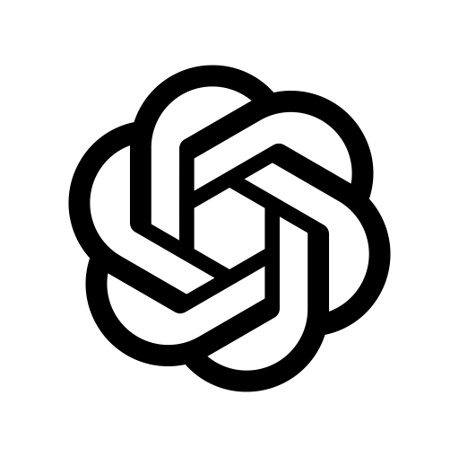

<h1 align="left">
  
  Contura Architecture Framework (CAF)
</h1>

<p align="center">
  <strong>Follow CAF on:</strong>
  <a href="https://medium.com/contura-architecture-framework/most-ai-coding-flows-jump-from-prompt-to-code-caf-keeps-architecture-in-the-loop-8af17300501a">Medium</a> ·
  <a href="https://x.com/conturacaf">X</a>
</p>

<p align="center">
  
  
  
  
  
</p>

CAF is the fail-closed architecture control layer for AI-assisted software delivery.

CAF helps teams move faster with coding agents while keeping the architecture in the loop.

CAF turns PRDs and architecture decisions into checkpoints, evidence, plans, and candidate code so teams can move quickly without losing control, traceability, or auditability.

<p align="center">
  
</p>

CAF is not prompt-to-code.

CAF keeps product intent, architecture decisions, planning, candidate code, and the optional richer UX lane connected through durable artifacts and fail-closed gates.

## What CAF does

- starts from product intent rather than a one-off build prompt
- keeps architecture active across planning and build
- produces candidate code, not silent autopilot-to-production output
- fails closed when required inputs or decisions are missing

## Quick start (ask-first)

```bash
git clone https://github.com/arylwen/caf.git
cd caf
/caf ask For codex-saas, what architecture decisions did we make, and why?
```

Use the canonical `codex-saas` sample to understand CAF before generating anything new.

Questions you can ask right away:

- `/caf ask Summarize the main features of the codex-saas reference architecture.`
- `/caf ask Which patterns were selected for codex-saas, and which pins drove them?`
- `/caf ask Given pin CP-4, what work is implied?`
- `/caf ask If we change code/ap/widgets/service.py, what intent/work is most likely impacted?`

## Quick start (create your own instance)

Replace `<instance>` with your own name.

| Command | Why you run it | Learn more |
| --- | --- | --- |
| `/caf saas <instance>` | Seed a new workspace with editable source docs, including PRD, platform PRD, UX vision, and guardrail defaults. Product manager and architect refine these seeded sources before downstream derivation. | [Installation](docs/user/02_installation.md), [PRD-first lifecycle](docs/user/15_prd_first_lifecycle.md), [Product manager view](docs/user/11_product_manager_view.md) |
| `/caf prd <instance>` | Resolve the PRD sources into lifecycle-ready product intent and architecture shape. This is the normal bridge from seeded documents into a usable downstream architecture flow. | [PRD workflow](docs/user/12_prd_workflow.md), [PRD-first lifecycle](docs/user/15_prd_first_lifecycle.md) |
| `/caf arch <instance>` | First architecture discovery pass. CAF proposes best-fit architectural choices and patterns from the promoted shape; the architect reviews and adjusts options before checkpointing. Examples include auth/session posture, deployment/runtime shape, persistence and API boundary structure. | [PRD-first lifecycle](docs/user/15_prd_first_lifecycle.md), [Core concepts](docs/user/04_core_concepts.md), [Pattern browser](docs/patterns/README.md) |
| `/caf next <instance> apply` | Checkpoint the adopted architecture so later phases consume a deterministic, auditable state instead of an in-progress scaffold. | [PRD-first lifecycle](docs/user/15_prd_first_lifecycle.md), [Instances, phases, and state](docs/user/05_instances_phases_and_state.md) |
| `/caf arch <instance>` | Second architecture/design pass. CAF elaborates technology and design choices needed for planning, such as contract declarations, control-plane/application design, normalized domain models, and implementation-oriented pattern choices. | [PRD-first lifecycle](docs/user/15_prd_first_lifecycle.md), [Core concepts](docs/user/04_core_concepts.md) |
| `/caf plan <instance>` | Compile obligations and adopted technology choices into the planner-owned task graph, task plan, and backlog that drive build. | [PRD-first lifecycle](docs/user/15_prd_first_lifecycle.md), [Feedback packets and debugging](docs/user/08_feedback_packets_and_debugging.md) |
| `/caf build <instance>` | Run the candidate build lane. CAF dispatches the planned tasks, tracks wave-state, and produces candidate code plus task reports/reviews. | [PRD-first lifecycle](docs/user/15_prd_first_lifecycle.md), [Traceability](docs/user/15_caf_traceability.md) |
| `/caf ux <instance>` | Derive the canonical richer UX artifacts after the second `/caf arch`, including UX design and visual-system semantics. | [Skills, runners, and command surface](docs/user/07_skills_runners_and_command_surface.md) |
| `/caf ux plan <instance>` | Turn the UX artifacts into the UX task graph, plan, and backlog for the separate UX realization lane. | [Skills, runners, and command surface](docs/user/07_skills_runners_and_command_surface.md), [PRD-first lifecycle](docs/user/15_prd_first_lifecycle.md) |
| `/caf ux build <instance>` | Realize the richer UX lane against the already-built backend/runtime truth, typically in a separate `ux` namespace/service within the same stack. | [Skills, runners, and command surface](docs/user/07_skills_runners_and_command_surface.md), [PRD-first lifecycle](docs/user/15_prd_first_lifecycle.md) |

The UX commands extend the main lifecycle. Run `/caf ux` after the second `/caf arch`, run `/caf ux plan` after `/caf ux`, and run `/caf ux build` after the main `/caf build` for the same instance.

## Runner CLI helpers

CAF itself stays runner-neutral and uses the `/caf ...` command surface inside the agent. For terminal runners, this repo also includes resumable helper wrappers under `tools/caf/cli/`:

- **Codex**: `tools/caf/cli/codex/`
  - default helper model: `gpt-5.3-codex`
  - default reasoning effort: `medium`
- **Claude Code**: `tools/caf/cli/claude/`
  - uses Claude print mode and skips permission prompts unless you override that behavior
- **Claude local / LM Studio**: `tools/caf/cli/claude-local/`
  - preserves the Claude helper lifecycle but injects local-endpoint environment plus LM Studio recovery/load knobs
- **Antigravity**: use the repo `.agent/` runner surface today; a packaged terminal wrapper is not included yet

Preferred launcher examples from the repo root:

```powershell
# Preferred on Windows: call the Node entrypoint directly
node .\tools\caf\cli\codex\run_caf_flow_v1.mjs codex-saas
node .\tools\caf\cli\claude\run_caf_flow_v1.mjs codex-saas
```

See the runner-specific READMEs for flags and resume behavior:

- [Codex CLI helper](tools/caf/cli/codex/README.md)
- [Claude CLI helper](tools/caf/cli/claude/README.md)
- [Claude local / LM Studio helper](tools/caf/cli/claude-local/README.md)

## What you get (and what you don’t)

- CAF produces **architecture, project plans, and candidate code**.
- CAF is **not** a ship-to-production generator: outputs are **candidate-only** and require human review.
- CAF is **fail-closed**: if inputs are missing or ambiguous, it emits a feedback packet instead of guessing.

## Find out more

[What is CAF?](docs/user/01_what_is_caf.md) — Get the shortest explanation of what CAF does and why it exists.

## You might also be interested in

- [PRD-first lifecycle](docs/user/15_prd_first_lifecycle.md) — Follow the default product-intent to architecture to plan to build path.
- [Answering questions with CAF](docs/user/14_answering_questions_with_caf.md) — See how `/caf ask` turns CAF into a queryable delivery surface.
- [Architect docs](docs/architect/README.md) — Go deeper on decisions, sizing, impact, and architect-operated workflows.

## More docs

- User docs: [`docs/user/README.md`](docs/user/README.md)
- Architect docs: [`docs/architect/README.md`](docs/architect/README.md)
- Maintainer guide: [`docs/maintainer/README.md`](docs/maintainer/README.md)
- Invariants and bounded claims: [`docs/architect/invariants/README.md`](docs/architect/invariants/README.md)
- Pattern browsing: [`docs/patterns/README.md`](docs/patterns/README.md)

## Repo landmarks

- `architecture_library/` — normative CAF intent: catalogs (patterns, TBPs, PBPs, policy matrices)
- `skills/` — canonical skill implementations; uses nodejs scripts to optimize token usage
- `skills_portable/` — instruction-only skill set (portable baseline)
- `.agent/` — router shim discovered by runners that use `/caf` under Antigravity
- `.claude/` — router shim discovered by runners that use `/caf` under Claude
- `.codex/` — router shim discovered by runners that use `/caf` under Codex
- `.copilot/` — router shim discovered by runners that use `/caf` under Copilot
- `.kiro/` — workspace skill shim discovered by Kiro IDE for `/caf` slash-command support

Generated at runtime (typically **gitignored**; may not exist until you run CAF):

- `reference_architectures/<instance>/` — generated architecture artifacts (do not hand-edit outside `ARCHITECT_EDIT_BLOCK`)
- `companion_repositories/<instance>/` — generated candidate code workspace

## Notes

- **Review the agent permissions in `.vscode/settings.json` and `.claude/settings.local.json` and make sure they meet your security requirements before running the agent.**
- **If you use Kiro IDE, keep `.kiro/skills/` in the repo so the workspace slash-command surface can discover CAF without copying canonical skills.**
- **Safety rule (agents):** CAF workflows should **not** run any `git` commands (read or write). Treat the working tree as the source of truth.

## Find CAF on

- Medium: [Architecture Still Matters in the Age of Vibe Coding](https://medium.com/contura-architecture-framework/most-ai-coding-flows-jump-from-prompt-to-code-caf-keeps-architecture-in-the-loop-8af17300501a)
- X: [CAF on X](https://x.com/conturacaf)
