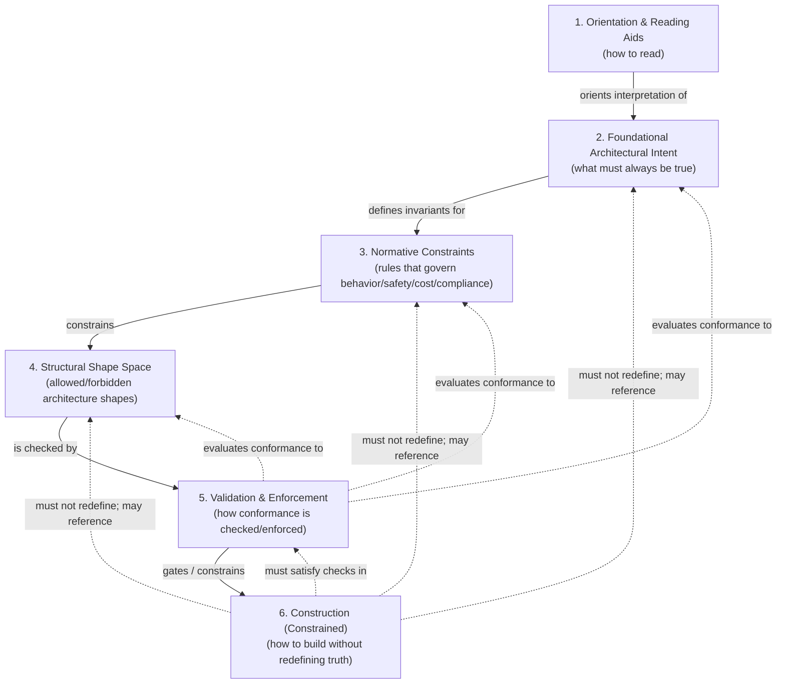

# Contura Architecture Framework (CAF) — How to Read This Library

CAF meta-patterns live in `architecture_library/patterns/caf_meta_v1/` (framework rules). CAF domain patterns live in `architecture_library/patterns/caf_v1/` (target-system patterns).

Version: v1  
Status: Informational  
Last Updated: 2025-12-15

---

## What Is the Contura Architecture Library?

According to the IEEE definition of architecture — *“fundamental concepts or properties of a system in its environment embodied in its elements, relationships, and in the principles of its design and evolution”* — all systems have an architecture.

That architecture exists whether or not it is documented, explicit, or consistently understood.

Because architecture reflects the principles by which a system is structured and evolves, it necessarily encodes **architectural intent** — even when that intent is implicit, fragmented, or only partially recoverable.

**Architectural intent** refers to the set of decisions, constraints, and invariants that shape what a system is, how it is structured, what it may become, and what it must not become.

### Illustrative Example (Non-Normative)

```markdown
**Architectural Intent:**  
“Tenant data MUST be isolated such that no execution can read or modify data belonging to another tenant.”

This intent defines *what must always be true*, independent of how the system is implemented.

**Workflow (One Possible Realization):**  

1. An API request arrives with an explicit Tenant Context.
2. Authorization is evaluated against tenant-scoped policy.
3. Data access is executed only within tenant-partitioned storage.
4. Evidence is emitted showing tenant-bound enforcement.

The workflow is *one way* the intent may be realized.  
The intent remains invariant even if the workflow, technology, or execution model changes.
```

In many systems, architectural intent remains **implicit**: it exists in the mind of the architect, is partially encoded in structure or code, and is inferred rather than stated.
Such systems exhibit an **accidental architecture**.

A system exhibits an **intentional architecture** when its architectural intent is made **explicit, visible, and enforceable**, rather than remaining implicit, inferred, or informal.

The **Contura Architecture Framework (CAF)** is the conceptual framework for **intentional architecture**.

CAF defines the vocabulary, principles, lifecycle, constraint model, and validation semantics needed to make architectural intent explicit and enforceable, independently of implementation choices.

The **Contura Architecture Library** is the authoritative specification and embodiment of CAF.

This library encodes CAF concepts as normative documents, constraints, and patterns that can be inspected, validated, and relied upon by humans and agents.

CAF helps you:

- Think clearly about system design
- Make architectural intent explicit and reviewable
- Understand which architectural choices are allowed, constrained, or forbidden
- Reason safely about execution and downstream automation

CAF does not construct systems or select technologies.  
Instead, CAF defines, structures, and validates architectural intent - the decisions, constraints, and invariants that shape the system.

It provides a disciplined vocabulary, lifecycle, and constraint model for reasoning about system shape - the abstract structural form of a system, including its boundaries, major responsibilities, interaction patterns, and permitted evolution over time - **before construction** and **independently of implementation choices**.

**Validation** is the mechanism by which CAF:

- Enforces architectural intent
- Prevents invention and drift
- Preserves system identity as it evolves
- Makes downstream automation safe and fail-closed

This library should be read as:

- A set of **normative architectural choices**, not suggestions
- A source of constraints and patterns, not recipes
- A foundation that downstream phases may build upon, but must not redefine

---

## Document Purpose

This document explains **how to read, understand, and apply the Contura Architecture Library**.

It exists to prevent a common and costly misunderstanding:

The Contura Architecture Library is not an implementation recipe.
It is a framework for intentional architecture, enforced through validation.

This document is intentionally written for humans — including those encountering the library for the first time.

---

## The Contura Architecture Mental Model

The Contura Architecture Library is organized into **six distinct conceptual layers**.

Each layer answers exactly one question.  
No layer may mix concerns with another.

This separation is intentional and foundational.

The diagram below illustrates the Contura Architecture layers and their permitted relationships.

Architectural intent flows downward; validation flows upward.
No layer may redefine or reinterpret upstream intent.



---

### 1. Orientation & Reading Aids  

**Question answered:**  
> *What is this library, and how do I read it?*

This layer exists to prevent confusion.

It explains:

- how the library is structured
- how documents relate to each other
- how to interpret what follows

These documents are explanatory, human-friendly, and non-normative.

**Authoritative documents:**

- `00_contura_architecture_library_taxonomy_v1.md` — Canonical map of the library
- `01_contura_architecture_how_to_read_this_library_v1.md` — How to interpret and apply the library
- `02_contura_document_output_standards_v2.md` — How Contura documents declare and render normative vs explanatory content
- `04_contura_architecture_glossary_v1.md` — Vocabulary and disallowed meanings
- `06_contura_architecture_library_roadmap_v1.md` — Evolution and reading order

---

### 2. Foundational Architectural Intent  

**Question answered:**  
> *What kind of system is this, and what must always be true?*

This layer defines the core invariants of Contura systems.

It establishes:

- the architectural worldview
- non-negotiable assumptions
- system-wide guarantees

Nothing in this layer depends on implementation details.

**Authoritative documents:**

- `03_contura_architecture_framework_v1.md` — CAF: invariants, principles, lifecycle
- `05_contura_saas_architecture_commitment_v1.md` — SaaS baseline and non-negotiable assumptions

---

### 3. Normative Constraints  

**Question answered:**  
> *What rules govern safety, cost, compliance, and behavior?*

This layer defines mandatory constraints that apply across all designs.

It answers questions such as:

- what is allowed
- what is forbidden
- what must be enforced regardless of architecture

These are normative assertions of architectural intent, not guidance.

**Authoritative documents:**

- `10_contura_ai_safety_gate_specification_v1.md`
- `11_contura_ai_observability_and_evaluation_specification_v1.md`
- `12_contura_cost_governance_finops_v1.md`
- `13_contura_compliance_automation_framework_v1.md`
- `24_contura_control_plane_domain_constraints_v1.md` (domain-specific constraints)

---

### 4. Structural Shape Space  

**Question answered:**  
> *What architectural shapes are allowed or forbidden?*

This layer constrains **how systems may be structured**.

It defines:

- permitted architectural patterns
- forbidden anti-patterns
- separation of concerns boundaries

It does not explain how to build, only what shapes are valid.

**Authoritative documents:**

- `20_contura_control_application_data_plane_pattern_guide_v1.md`
- `21_contura_multi_tenancy_patterns_v1.md`
- `21_contura_channel_resilient_delivery_pattern_guide_v1.md`
- `22_contura_identity_access_pattern_guide_v1.md`
- `22_contura_policy_engine_architecture_guide_v1.md`
- `23_contura_data_governance_and_data_quality_standards_v1.md`

---

### 5. Validation & Enforcement  

**Question answered:**  
> *How do we check and enforce architectural intent and constraints?*

This layer makes architecture **testable and enforceable**.

It does not define architectural intent or introduce new decisions.  
Instead, it evaluates whether declared intent has been preserved.

This layer defines:

- validation mechanisms
- checklists and classifications
- enforcement points
- incident semantics

Architectural intent and constraints are defined upstream.  
This layer does not change them — it only evaluates conformance and enforces their application.
Contura architecture works like TDD: we define the architectural assertions first, then define how to test them, and only then build.

**Scope of Validation (Layer 5)**  
  
Layer 5 (Validation & Enforcement) evaluates **systems, designs, and evidence** against declared architectural intent (layers 6+).  
It does **not** evaluate or arbitrate the correctness of the architectural intent itself (layers 1-4).  
  
Coherence and correctness between upstream layers (Orientation, Intent, Constraints, Shape Space) are a **library governance responsibility**.  
Validation assumes upstream intent is authoritative and enforces it **downstream** to prevent drift in construction and execution.

**Authoritative documents (human-readable):**

- `30_contura_multi_tenancy_validation_guide_v1.md`
- `31_contura_multi_tenancy_validation_user_guide_v1.md`
- `32_contura_multi_tenancy_incident_classification_v1.md`

**Authoritative documents (machine-readable / executable):**

- `60_executable_architecture_overview_v1.md`
- `61_contura_multi_tenancy_validation_schema_v1.yaml`
- `62_contura_multi_tenancy_validation_checks_v1.json`
- `63_contura_multi_tenancy_policy_rules_v1.yaml`

---

### 6. Construction (Constrained) — Conceptual Layer 6 and the Operational Derivation (Operational Layers 6–8)

**Question answered:**  
> *Given all the above, how do I start building?*

This layer provides **constrained, downstream build guidance**. It exists to:

- help humans and agents start safely  
- reduce guesswork  
- operationalize constraints into buildable, machine-checkable inputs  

Construction guidance may change freely, but it must never redefine architectural intent.

#### What “derivation” means (and why it lives here)

In CAF, **derivation** is the **constrained, top-down operationalization** of architectural intent (Layers 1–5) into **build-ready, machine-checkable implementation inputs**.  
You are moving from *principles and invariants* to *explicit, pinned, validated artifacts*—and you are not allowed to introduce new, ungoverned choices during the derivation.

#### Conceptual vs Operational layers (disambiguation)

- **Conceptual Layer 6 (Construction):** the library’s reading-model layer describing how we go from intent → build.  
- **Operational Layers 6–8 (Derivation artifacts):** the concrete, file-backed workflow that performs construction in a constrained way.

#### Operational Layers 6–8 at a glance (the official “start building” path)

| Operational Layer | What it is | Who edits it | Where choices come from | Key rule |
|---|---|---|---|---|
| **Operational Layer 6 (Pinned Inputs)** | `reference_architectures/<name>/layer_6/architecture_shape_parameters.yaml` | Architect | Allowed template parameters + allowed values come from `07_contura_parameterized_architecture_templates_v1.md`. File shape is enforced by `06_contura_architecture_shape_parameters_schema_v1.yaml`. | All parameters must be pinned using allowed values (Gate V1: Pin Closure). |
| **Operational Layer 7 (Derived Bundle)** | `reference_architectures/<name>/layer_7/…` (derived ADRs, validation mappings, supporting artifacts) | Generated (assistant/tool) | No new choices are permitted here; derivation must be grounded in Layers 1–6 and the derivation rules. | **No new choices**; generation must be fail-closed. |

> **Canonical process document:** the authoritative step-by-step procedure and gates for Operational Layers 6–8 are defined in `09_contura_instance_derivation_process_6_to_8_v1b2.md`.

#### Fail-closed escalation (feedback packets)

If a choice is missing, the library is inconsistent, or a mapping is unclear, **do not invent new parameters or values**.  
Instead, emit an official **feedback packet** at:

- `reference_architectures/<name>/feedback_packets/`

…and stop until the library is corrected.

---

**Authoritative documents (Construction / Derivation / Phase 8)**

Derivation + pinning inputs:
- `09_contura_instance_derivation_process_6_to_8_v1b2.md`
- `06_contura_architecture_shape_parameters_schema_v1.yaml`
- `07_contura_parameterized_architecture_templates_v1.md`

Reference implementation derivation / structure:
- `70_contura_reference_implementation_structure_and_derivation_contract_v1.md`

- `phase_8/81_phase_8_implementation_profile_template_v1.md`
- `phase_8/82_phase_8_directory_and_naming_conventions_v1.md`
- `phase_8/84_phase_8_manual_delivery_backlog_v1.md`
- `phase_8/84_phase_8_profile_parameters_naming_and_placement_v1.md`
- `phase_8/84_phase_8_profile_parameters_schema_v1.yaml`
- `phase_8/84_phase_8_profile_parameters_template_v1.yaml`
- ``

Examples / reference profiles:
- `phase_8/profiles/intentionally_boring_saas/implementation_profile_v1.md`
- `phase_8/profiles/intentionally_boring_saas/companion_repository_skeleton_profile_v1.md`
- `phase_8/stack_profile_proposals/` (stack profile proposal workspace; proposals live under this directory)

---

## One Rule Governs All Layers

Each document belongs to exactly **one conceptual layer**.

Documents may reference upstream layers,  
but must never mix the architectural intent definition, validation, and construction.

This principle is called **Semantic Isolation**.

Violations of semantic isolation are architectural defects.

--

## What Contura Architecture Is (in One Sentence)

Contura architecture is **test-driven architecture**:  
we define what must be true first, then define how to prove it.

Everything else follows from this principle.

---

## Architecture as Truth, Not Advice

Most architecture documentation offers guidance, recommendations, or examples.

Contura does not.

Contura architecture defines **truth conditions**:

- A system either satisfies them or it does not
- Compliance must be provable
- Violations must be detectable
- Claims require evidence

This is why Contura architecture feels strict: it is intentionally falsifiable.

---

## The Validation Lattice (Core Mental Model)

The Contura Architecture Library is structured as a **validation lattice**, not a build guide.

Each layer answers a specific question:

| Layer | What it does |
| ------ | ------------- |
| CAF + Governance (00–13) | Define what must be true, the architectural intent. |
| Pattern Guides (20–23) | Define allowed and forbidden shapes |
| Validation Guides (30–32) | Define how conformance to architectural intent is evaluated |
| ADRs (40–43) | Capture decisions and required evidence |
| Meta Artifacts (61–63) | Make checks machine-readable |

Together, these layers form a closed system:

> If something is claimed, it must be provable.  
> If it fails, the reason must be explainable.

This is the Contura validation lattice.

---

## What This Library Is Not

To use Contura correctly, it is important to understand what this library **does not attempt to do**.

It is not:

- A step-by-step build tutorial
- A reference implementation library
- A “best practices” handbook
- A code generation guide
- A catalog of optional recommendations

Those are **build paths** — and they are intentionally separate.

---

## Why This Is Intentional (The TDD Analogy)

Contura follows the same philosophy as Test-Driven Development (TDD):

1. Define the assertion
2. Define how to test it
3. Only then write code

You would never:

- write code first, then invent tests to justify it

Likewise, Contura does not:

- build systems first, then retrofit governance

Mapping the analogy:

| TDD Concept | Contura Equivalent |
| ------------ | ------------------- |
| Test assertions | CAF + Governance |
| Test cases | Validation Guides |
| Test harness | Meta Artifacts |
| Test reports | ADRs + Evidence |

This is architecture that is designed to fail safely and visibly.

---

## How to Read the Library (Practical Guidance)

### If You Are New

Start here, in order:

1. **03 — Contura SaaS Baseline Statement**  
   Understand what kind of system Contura assumes.
2. **01 — Contura Architecture Framework (CAF)**  
   Learn what must always be true.
3. **20 — Control / Application / Data Plane Pattern Guide**  
   Understand the structural universe you are allowed to design in.
4. **21 — Multi-Tenancy Patterns Guide**  
   Learn what mistakes are forbidden.
5. **30 — Multi-Tenancy Validation Guide**  
   Learn how compliance is evaluated.

At this point, you should feel constrained.  
That is expected and intentional.

---

### If You Are Designing Something New

Do not ask:

> “How do I build this?”

Instead ask:

> “What must be true when this exists?”

Then:

- Identify relevant checklist IDs
- Decide where enforcement occurs (Control, Application, Data plane)
- Capture decisions and scope in ADRs
- Produce evidence artifacts

Only then should code be written.

---

## Where Build Paths Fit

Build paths will exist as **downstream, agent-facing artifacts**.

They will:

- Be opinionated
- Be replaceable
- Be constrained by this library

They will never redefine truth.

If a build guide contradicts CAF, a pattern guide, or a validation rule, the build guide is wrong.

---

## Why This Matters (Especially for AI Agents)

This structure exists because:

- Humans forget rules
- Agents hallucinate structure
- Scale amplifies small mistakes
- Multi-tenancy and AI failures are systemic and severe

A validation-first architecture ensures:

- Agents can be blocked
- Claims can be verified
- Failures can be classified
- Architecture can improve over time

---

## One Sentence to Remember

**Contura architecture is not a construction kit.  
It is a truth system.**

Build systems plug into it.  
They do not redefine it.

---

## Relationship to Other Documents

This document is explanatory and non-normative.

Where interpretation conflicts arise, the following documents are authoritative:

- 03_contura_architecture_framework_v1.md
- Governance specifications (10–13)
- Pattern guides (20–23)
- Validation guides (30–32)
- ADR standards and templates (40–43)

---

## Version History

v1 — Initial human-readable explanation of the Contura validation lattice and how to interpret the architecture library.


### CAF meta-patterns
CAF meta-patterns (framework-level invariants and low-friction human-signal mechanics) live under:
- `architecture_library/patterns/caf_meta_v1/`

They explain *how CAF works* (retrieve → propose → human resolve → downstream consumes adopted signals), and are referenced by Phase 8 contracts.
