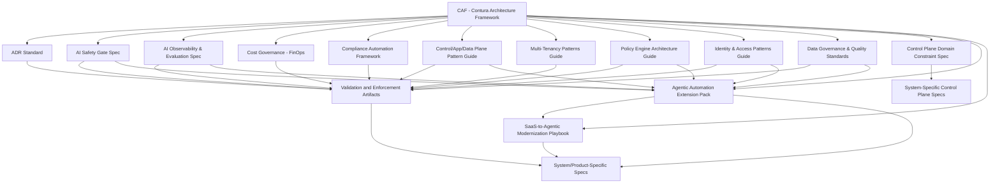

# Contura Architecture Library Roadmap v1 (Draft)

> **Scope note (2026-03-29):** This file is the architecture-library authoring/order roadmap. It is not the primary CAF product/platform roadmap. For current CAF roadmap planning, use `docs/dev/roadmaps/roadmap_north_star_v1.md`, `docs/dev/roadmaps/roadmap_combined_v1.md`, and `docs/dev/roadmaps/caf_product_roadmap_v1.md`.

Version: v1  
Status: Draft for Review  
Last Updated: 2026-03-15

## 1. Purpose

This document describes the order, dependencies, and evolution path for the Contura Architecture Library. It ensures that CAF and all downstream branch-out artifacts are created and evolved in a coherent, dependency-aware sequence.

The audience is Contura architects and leads responsible for planning and authoring architecture documents.

## 2. Scope

This roadmap covers:

1. The main categories of architecture documents used in the library.  
2. The recommended creation order based on conceptual and practical dependencies.  
3. A high-level dependency graph using Mermaid-style notation (plain text).  
4. Minimal rules for updating and extending the library.

This roadmap does not define the full content of each document. Content is defined in the documents referenced here.

## 3. Document Categories

The Contura Architecture Library is organized into the following high-level categories:

1. Core Framework  
2. Governance Documents  
3. Structural Pattern Guides  
4. Domain Constraint Specifications  
5. Validation & Enforcement Artifacts  
6. Extension Packs & Modernization Playbooks  
7. System- and Product-Specific Specifications

These categories reflect the layered model described in the taxonomy and the non-authority rules defined by CAF.

## 4. Recommended Creation Order

The following phases define the recommended order for creating and evolving documents.

### 4.1 Phase 0 — Core Framework (Completed)

1. Contura Architecture Framework (CAF)  
   - Status: Completed and uploaded as `03_contura_architecture_framework_v1.md`  
   - Role: Constitutional meta-framework; all downstream artifacts derive from CAF.

### 4.2 Phase 1 — Governance Documents and Decision Bases

Governance documents define *how* decisions are evaluated, approved, and controlled. They act as gates, evaluators, and decision-shaping surfaces for all later artifacts.

Recommended documents:

1. Architectural Decision Record (ADR) Standard  
2. AI Safety Gate Specification  
3. AI Observability & Evaluation Specification  
4. Cost Governance (FinOps) Playbook  
5. Compliance Automation Framework

No downstream artifact that materially changes autonomy, safety, cost, or compliance posture should be considered stable without referencing the relevant governance documents.

### 4.3 Phase 2 — Structural Pattern Guides

Structural pattern guides define reusable architectural patterns used by multiple systems and multiple downstream artifacts. They answer “how” at a solution-shape level without introducing independent architectural authority.

High-priority pattern guides:

1. Control / Application / Data Plane Pattern Guide  
2. Multi-Tenancy Patterns Guide  
3. Policy Engine Architecture Guide  
4. Identity & Access Patterns Guide  
5. Data Governance & Data Quality Standards Guide  
6. Event-Driven / Async Workflow guidance where needed

These guides should exist (at least at draft level) before freezing derived constraints, executable checks, or modernization packs that depend on them.

### 4.4 Phase 3 — Domain Constraint Specifications (Rare)

Domain Constraint Specifications are rare, authority-bearing artifacts used only when a domain exerts true cross-system architectural authority that cannot be expressed by patterns alone.

Recommended current focus:

1. Contura SaaS Control Plane Domain Constraint Specification (experimental)

Explicit non-goals for this phase:

- do not create standalone authority-bearing frameworks for AI & Agentic Systems  
- do not create standalone authority-bearing frameworks for Application Plane, Data Plane, DevEx, Observability, or MLOps unless CAF itself is revised to grant that authority

### 4.5 Phase 4 — Validation & Enforcement Artifacts

Validation and enforcement artifacts operationalize CAF and its downstream guidance. They do not define architecture; they enforce, check, or score conformance.

Recommended artifacts:

1. Executable Architecture Overview  
2. Validation schemas and rule packs  
3. Multi-Tenancy Validation Guide and checks  
4. Policy rule bundles and related evaluator surfaces

These artifacts should be built after the relevant governance documents and structural pattern guides are in place.

### 4.6 Phase 5 — Extension Packs & Modernization Playbooks

Extension packs and modernization playbooks package non-authoritative, cross-cutting guidance that is broader than one pattern family but does not justify a separate architecture framework layer.

Recommended current focus:

1. Agentic Automation Extension Pack  
   - Scope: planner / executor / verifier patterns, bounded autonomy, tool boundaries, memory / retrieval boundaries, HITL escalation, auditability, observability, delegated authority.
2. SaaS-to-Agentic Modernization Playbook  
   - Scope: staged transition from boring SaaS to governed AI-assisted workflows and then to bounded agentic automation.

These artifacts should derive from CAF plus the relevant governance and pattern surfaces. They must not redefine architectural authority.

### 4.7 Phase 6 — System- and Product-Specific Specifications

System-level and product-level documents derive from CAF and the relevant downstream artifacts. They are not covered in detail here. They must conform to CAF, applicable governance documents, applicable structural pattern guides, any relevant rare domain constraints, and any adopted extension packs or modernization playbooks.

## 5. Dependency Overview (Mermaid-Style Diagram)

The following Mermaid-style graph illustrates key dependencies between major document categories.

Mermaid-style (plain text, no inner code fence):

## 6. Usage Guidelines

1. When authoring a new document, check this roadmap to identify upstream dependencies (CAF, governance documents, pattern guides, rare domain constraints, executable checks, extension packs) that must exist or be drafted first.  
2. When updating a governance, pattern, or constraint document, assess the impact on validation artifacts, extension packs, modernization playbooks, and system-level specs that depend on it.  
3. Avoid adding implementation-level guidance into CAF; instead, extend or create structural pattern guides, validation artifacts, extension packs, or modernization playbooks. Reserve Domain Constraint Specifications for rare cross-system authority surfaces only.

## 7. Extensibility Rules

1. New Domain Constraint Specifications must be referenced in this roadmap and in CAF’s branch-out index, and they must justify why the domain holds cross-system architectural authority.  
2. New structural pattern guides must declare which governance or downstream artifacts they support.  
3. New governance specs must declare which decisions, risks, or processes they evaluate or gate.  
4. New extension packs and modernization playbooks must declare that they are non-authoritative and list their upstream dependencies.  
5. Major changes to dependency relationships require a new version of this roadmap.

## 8. Version History

v1 — Roadmap updated to align with CAF’s layered taxonomy, replacing outdated standalone AI/domain-framework planning with rare domain constraints plus extension-pack and modernization-playbook packaging.
