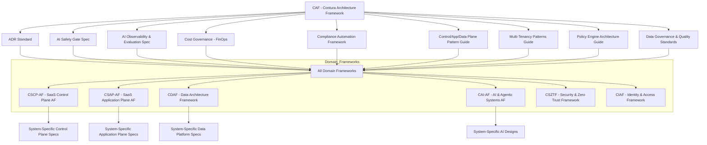

# Contura Architecture Library Roadmap v1 (Draft)

Version: v1  
Status: Draft for Review  
Last Updated: 2025-12-12

## 1. Purpose

This document describes the order, dependencies, and evolution path for the Contura Architecture Library. It ensures that Contura’s core framework (CAF) and all branch-out documents are created and evolved in a coherent, dependency-aware sequence.

The audience is Contura architects and leads responsible for planning and authoring architecture documents.

## 2. Scope

This roadmap covers:

1. The main categories of architecture documents (frameworks, pattern guides, governance docs).  
2. The recommended creation order based on conceptual and practical dependencies.  
3. A high-level dependency graph using Mermaid-style notation (plain text).  
4. Minimal rules for updating and extending the library.

This roadmap does not define the full content of each document. Content is defined in the documents referenced here.

## 3. Document Categories

The Contura Architecture Library is organized into three high-level categories:

1. Core Framework  
2. Governance Documents  
3. Pattern Libraries  
4. Domain Architecture Frameworks  
5. System- and Product-Specific Specifications

Each category has a recommended sequencing and dependency structure.

## 4. Recommended Creation Order

The following phases define the recommended order for creating and evolving documents.

### 4.1 Phase 0 — Core Framework (Completed)

1. Contura Architecture Framework (CAF)  
   - Status: Completed and uploaded as 03_contura_architecture_framework_v1.md  
   - Role: Constitutional meta-framework; all other documents derive from CAF.

### 4.2 Phase 1 — Governance Documents (Evaluators)

Governance documents define *how* decisions are evaluated, approved, and controlled. They act as evaluators and gates for all subsequent frameworks.

Recommended documents:

1. Architectural Decision Record (ADR) Standard  
2. AI Safety Gate Specification  
3. AI Observability & Evaluation Specification  
4. Cost Governance (FinOps) Playbook  
5. Compliance Automation Framework

No domain framework (e.g., CSCP-AF, CSAP-AF) should be considered “stable” without referencing the relevant governance documents.

### 4.3 Phase 2 — Core Pattern Libraries (Foundational Techniques)

Pattern libraries define reusable architectural patterns used by multiple domain frameworks. They answer “how” at a solution level without binding to specific technologies.

High-priority pattern libraries:

1. Control/Application/Data Plane Pattern Guide  
2. Multi-Tenancy Patterns Guide  
   - Includes patterns such as row-level security (RLS), tenant partitioning, pooled vs. silo vs. hybrid tenancy.  
3. Policy Engine Architecture Guide  
4. Data Governance & Data Quality Standards Guide

These patterns must exist (at least at draft level) before freezing the SaaS domain frameworks, as they are heavily referenced by them.

### 4.4 Phase 3 — Domain Architecture Frameworks

Domain frameworks apply CAF principles, pillars, and patterns to specific areas of the platform.

Recommended order:

1. Contura SaaS Control Plane Architecture Framework (CSCP-AF)  
2. Contura SaaS Application Plane Architecture Framework (CSAP-AF)  
3. Contura Data Architecture Framework (CDAF)  
4. Contura AI & Agentic Systems Architecture Framework (CAI-AF)  
5. Contura Security & Zero Trust Framework (CSZTF)  
6. Contura Identity & Access Framework (CIAF)  
7. Contura Developer Platform & DevEx Framework (CDPF)  
8. Contura Observability & Telemetry Framework (COTF)  
9. Contura MLOps & Model Lifecycle Framework (CMLF)

Each of these frameworks must reference:

- CAF (as the meta-framework).  
- Relevant governance docs (ADR, AI Safety, FinOps, Compliance).  
- Relevant pattern libraries (e.g., multi-tenancy and RLS for CSCP-AF and CSAP-AF).

### 4.5 Phase 4 — System- and Product-Specific Specs

System-level and product-level documents (for specific control planes, application planes, and data platforms) derive from the domain frameworks and are not covered in detail here. They must conform to CAF and the relevant domain and governance documents.

## 5. Dependency Overview (Mermaid-Style Diagram)

The following Mermaid-style graph illustrates key dependencies between major document categories.

Mermaid-style (plain text, no inner code fence):

## 6. Usage Guidelines

1. When authoring a new document, check this roadmap to identify upstream dependencies (frameworks, governance docs, pattern guides) that must exist or be drafted first.  
2. When updating a governance or pattern document, assess the impact on domain frameworks and system-level specs that depend on it.  
3. Avoid adding implementation-level guidance into CAF; instead, extend or create pattern libraries and domain frameworks.

## 7. Extensibility Rules

1. New domain frameworks must be referenced in this roadmap and in CAF’s branch-out index.  
2. New pattern libraries must declare which domain frameworks they support.  
3. New governance specs must declare which decisions or processes they evaluate or gate.  
4. Major changes to dependency relationships require a new version of this roadmap.

## 8. Version History

v1 — Initial roadmap defining categories, phases, and a dependency graph for the Contura Architecture Library.
