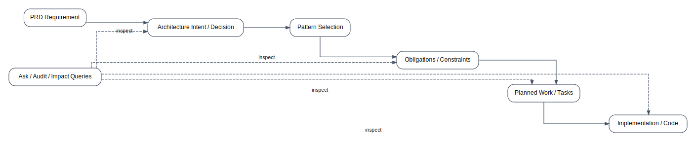

# Traceability chain and data model

This doc explains the **objects** CAF uses to make the three architect questions answerable.

*CAF preserves traceability from requirements to implementation by linking requirements, architecture decisions, pattern choices, obligations, tasks, and code into a single inspectable chain.*

## Objects (with canonical responsibilities)

### Pins

- Meaning: explicit intent (what the architect commits to)
- Typical location:
  - `spec/playbook/*_spec_v1.md`
  - `spec/playbook/architecture_shape_parameters.yaml`
  - `spec/guardrails/profile_parameters_resolved.yaml` (optional)

### Patterns

- Meaning: candidate architecture decisions sourced from the library
- State: `adopt | defer | reject`

### Decision patterns

- A pattern with bounded question/option sets (`caf.kind: decision_pattern`).
- Enforced invariant: **exactly 1 adopted option** per question.

### Obligations

- Meaning: required deliverables implied by adopted patterns
- Canonical location:
  - `design/playbook/pattern_obligations_v1.yaml`

### Capabilities

- Meaning: types of work required to satisfy obligations
- Surface:
  - `required_capabilities` on tasks
  - capability coverage gates

### Tasks

- Meaning: ordered execution units; the planner’s output
- Canonical location:
  - `design/playbook/task_graph_v1.yaml`

### Artifacts

- Meaning: outputs produced by tasks (spec/design/playbooks/diagnostics/code)
- Ownership: governed by phase + playbook invariants

## “Ask context pack” as a first-class derived artifact

When you run `/caf ask ...`, CAF materializes:

- `.../caf_meta/ask_context_v1.md`

This is a deterministic selection of the smallest artifact set needed to answer:

- decision visibility
- work visibility
- impact assessment

See: [`06_caf_ask_internals.md`](06_caf_ask_internals.md)

## Next

[CAF ask internals](06_caf_ask_internals.md) — See how CAF assembles a bounded context pack from the traceability surfaces described here.

## Related

- [Decision visibility](02_decision_visibility.md) — Focus on the artifacts used to answer “what did we decide?”.
- [Work visibility and sizing](03_work_visibility_sizing.md) — Focus on the artifacts used to answer “what work exists and how big is it?”.
- [Impact assessment](04_impact_assessment.md) — Focus on the artifacts used to answer “what does this change affect?”.
