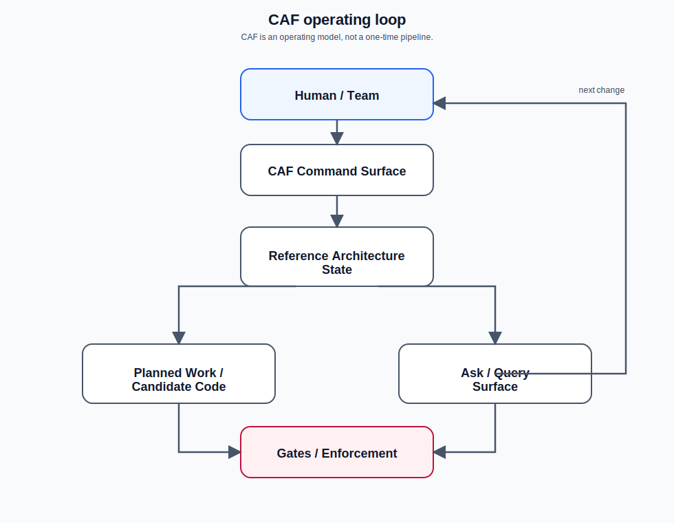

# CAF architect docs (advanced)

CAF turns PRDs into architecture, project plans, and candidate code through orchestrated, governed AI generation.

This folder is for **software architects, solution architects, and platform engineers**.

It goes deeper than `docs/user/` and focuses on how CAF helps teams answer three durable questions:

*CAF is a continuous architecture-guided operating loop with retrieval, gates, and queryable state.*

1) **What architecture decisions did we make, and why?**
2) **For this product or architecture intent, how big is the work?**
3) **If we change X, what features or architectural intent does it impact?**

## Quick entry points

- Mental model + traceability chain: [`01_mental_model.md`](01_mental_model.md)
- Decisions (what + why): [`02_decision_visibility.md`](02_decision_visibility.md)
- Sizing (how big is the work): [`03_work_visibility_sizing.md`](03_work_visibility_sizing.md)
- Change impact: [`04_impact_assessment.md`](04_impact_assessment.md)

## Ask-first workflow (architect-friendly)

CAF is designed so you can answer the three questions above via a single UX surface:

- `/caf ask <question...>`

Mechanically, `/caf ask` classifies an intent and materializes a compact **ask context pack** at:

- `reference_architectures/<instance>/{spec|design}/caf_meta/ask_context_v1.md`

See: [`06_caf_ask_internals.md`](06_caf_ask_internals.md)

## Read by goal

- **Understand traceability and ask surfaces** — Start with [Mental model](01_mental_model.md), then read [Traceability data model](05_traceability_chain_and_data_model.md) and [CAF ask internals](06_caf_ask_internals.md) to see how architect questions map to durable state.
- **Understand decisions, sizing, and impact** — Read [Decision visibility](02_decision_visibility.md), [Work visibility sizing](03_work_visibility_sizing.md), and [Impact assessment](04_impact_assessment.md) for the three core architect questions CAF is designed to answer.
- **Understand patterns, obligations, and fail-closed behavior** — Follow [Patterns → obligations → tasks](07_patterns_to_obligations_to_tasks.md), [Gates + fail-closed behavior](08_gates_and_fail_closed.md), and [Drift resistance + audits](09_drift_resistance_and_audits.md) to see how architecture intent becomes governed downstream work.
- **Review the PRD-first architect flow in context** — Pair [Architect workflows](10_architect_workflows.md) with [PRD → Architecture Shape](../user/12_prd_workflow.md) and [PRD-first lifecycle](../user/15_prd_first_lifecycle.md) to see how architect-facing work now fits into the default lifecycle.

## Recommended reading order

1. [Mental model](01_mental_model.md)
2. [Traceability data model](05_traceability_chain_and_data_model.md)
3. [How CAF answers “decisions + why”](02_decision_visibility.md)
4. [How CAF answers “how big is the work”](03_work_visibility_sizing.md)
5. [How CAF answers “if we change X, what breaks”](04_impact_assessment.md)
6. [CAF ask internals](06_caf_ask_internals.md)
7. [Patterns → obligations → tasks](07_patterns_to_obligations_to_tasks.md)
8. [Gates + fail-closed behavior](08_gates_and_fail_closed.md)
9. [Drift resistance + audits](09_drift_resistance_and_audits.md)
10. [Architect workflows](10_architect_workflows.md)
11. [Customization surfaces](11_customization_surfaces.md)
12. [Reference map](12_reference_map.md)

For the end-to-end default sequence from seeded PRD to build, see also: [`../user/15_prd_first_lifecycle.md`](../user/15_prd_first_lifecycle.md)

## Related deep notes

For deeper mechanics, start with:

- `architecture_library/patterns/caf_meta_v1/caf_derivation_cascade_meta_patterns_v1.md`
- `architecture_library/patterns/caf_meta_v1/caf_promotions_and_obligations_meta_patterns_v1.md`
- `architecture_library/patterns/caf_meta_v1/caf_directory_and_enforcement_meta_patterns_v1.md`
- `docs/maintainer/README.md`
