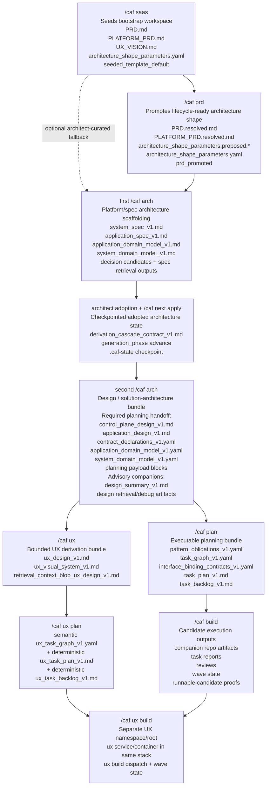

# CAF lifecycle artifact handoff

This diagram captures the main artifact handoffs across the default CAF lifecycle.

Use it when you need to explain:

- which command turns one artifact set into the next,
- why the two `/caf arch` passes are different,
- what `/caf next <instance> apply` really checkpoints,
- which bundle `/caf plan`, `/caf build`, `/caf ux`, `/caf ux plan`, and `/caf ux build` actually consume.

For a document-by-document explanation of the files named below, see [Lifecycle artifact reference](../11_lifecycle_artifact_reference.md).

## Notes

- The first `/caf arch` is the promoted-shape to spec/platform-pattern step. The dotted `/caf saas -> first /caf arch` edge is the explicit architect-curated fallback when a detailed PRD is unavailable.
- The second `/caf arch` is the adopted-spec/domain/supporting-files to design-bundle step. Within that handoff, `/caf plan` should treat the core design docs, contract declarations, normalized YAML domain models, and planning payload blocks as the main planning inputs; design summaries and retrieval/debug sidecars remain supporting context.
- `/caf ux` is now a real downstream consumer of the later design handoff. It does not replace the second `/caf arch` design pass.
- `/caf ux plan` now follows the same ownership posture as `/caf plan`: semantic task shaping first, deterministic projections after.
- `/caf ux build` depends on the main `/caf build` lane for runtime/API truth, but it does not replace the smoke-test UI lane.
