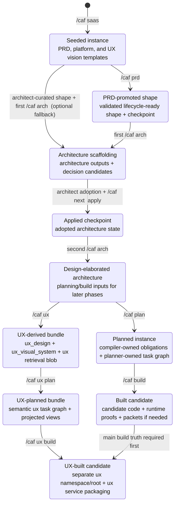

# CAF lifecycle state machine

This diagram captures the main lifecycle states and transition commands in CAF.

Use it when you need to explain:

- which command advances the lifecycle,
- which states are checkpoints versus derivation states,
- how the two `/caf arch` passes relate to later planning and build,
- where the bounded UX lane fits without replacing the main lifecycle.

For artifact flow and handoff surfaces, pair this diagram with [CAF lifecycle artifact handoff](caf_lifecycle_artifact_handoff_v1.md).

## Notes

- The seeded shape is a bootstrap editable surface, not the normal lifecycle-ready input for the first architecture scaffold.
- The direct `Seeded -> first /caf arch` path is an explicit architect-curated fallback for cases where a detailed PRD is not yet available; it is not the default lifecycle.
- The first `/caf arch` run after `/caf prd` is the promoted-shape to spec/platform-pattern transition. When the PRD is skipped, the same first scaffold consumes an architect-curated shape instead.
- The second `/caf arch` is the adopted-spec/domain/supporting-files to design-bundle transition.
- `/caf next <instance> apply` is a checkpoint transition, not a replacement for architect review.
- `/caf ux` and `/caf ux plan` are real downstream lifecycle states, but they do not replace `/caf plan` or `/caf build`.
- `/caf ux build` depends on the main `/caf build` lane because the UX lane realizes against runtime/API truth rather than inventing a parallel backend.
