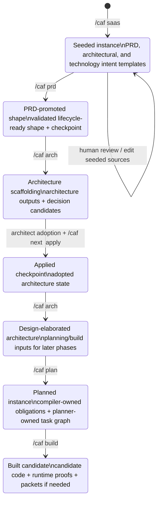

# CAF lifecycle state machine

This diagram captures the default CAF command-flow lifecycle as states and transitions.

Use it when you need to reason about:

- what `/caf saas` actually seeds
- where `/caf prd` fits before the first scaffold
- what `/caf next <instance> apply` checkpoints
- how `/caf plan` and `/caf build` relate to earlier lifecycle states

## Notes

- The seeded shape is a bootstrap editable surface, not the normal lifecycle-ready input for the first architecture scaffold.
- The first `/caf arch` run after `/caf prd` is the default architecture-scaffolding transition.
- `/caf next <instance> apply` is a checkpoint transition, not a replacement for architect review.
- `/caf plan` and `/caf build` are later lifecycle transitions that depend on earlier states being valid.
