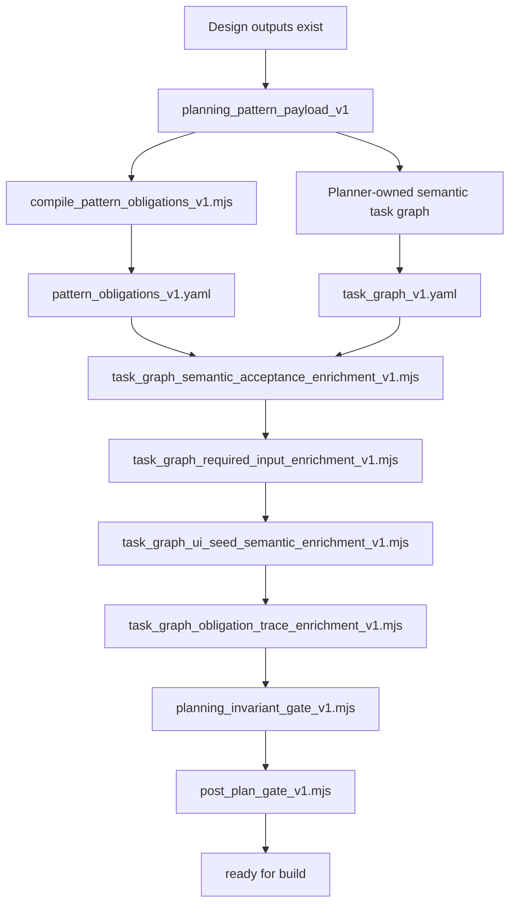

# CAF plan post-chain

This diagram captures the internal `/caf plan` post-chain after design outputs exist.

Use it when you need to reason about:

- where compiler-owned obligations are produced
- what remains planner-owned
- where deterministic enrichers attach additional structure
- which gates fail closed before build

## Notes

- `pattern_obligations_v1.yaml` is compiler-owned.
- `task_graph_v1.yaml` remains planner-owned for task structure, dependencies, and semantic anchors.
- The enrichers attach deterministic structure after the planner-owned step.
- The gates fail closed rather than compensating silently for missing semantic work.
