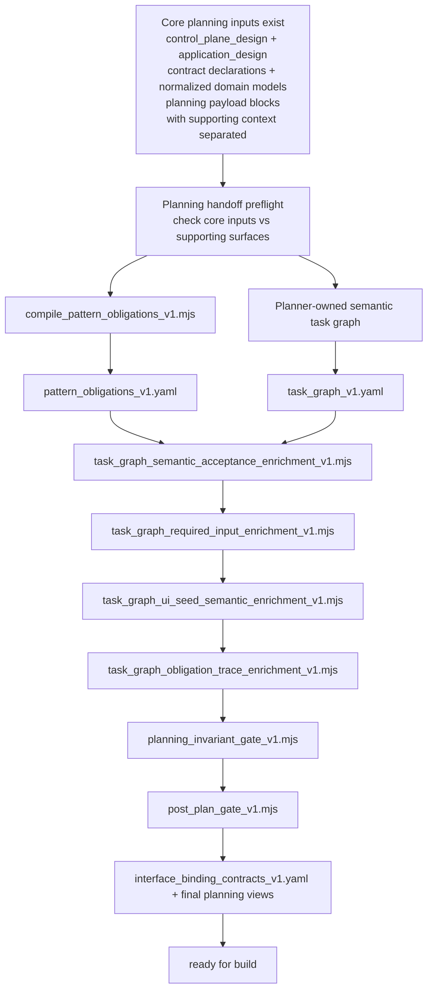

# CAF plan post-chain

This diagram captures the internal `/caf plan` post-chain after design outputs exist.

Use it when you need to reason about:

- where compiler-owned obligations are produced
- what remains planner-owned
- where deterministic enrichers attach additional structure
- which gates fail closed before build

## Notes

- The planning preflight should treat the second `/caf arch` bundle as a real handoff surface and separate the core planning inputs (design docs, contract declarations, normalized domain-model YAMLs, planning payload blocks) from the supporting explanation/debug surfaces (design summary, retrieval/debug sidecars).
- `pattern_obligations_v1.yaml` is compiler-owned.
- `task_graph_v1.yaml` remains planner-owned for task structure, dependencies, and semantic anchors.
- The enrichers attach deterministic structure after the planner-owned step, including required-input, trace, and interface-binding derivations.
- A future `/caf ux` lane, if adopted later, would not replace this seam; it would either consume the same later design handoff as a sibling lane or emit an additional bounded artifact bundle that planning can consume explicitly.
- Missing core planning inputs should become fail-closed once the responsible second `/caf arch` pass has run. Missing supporting explanation/debug surfaces should surface advisory feedback rather than block planning by themselves.
- The gates fail closed rather than compensating silently for missing semantic work.
