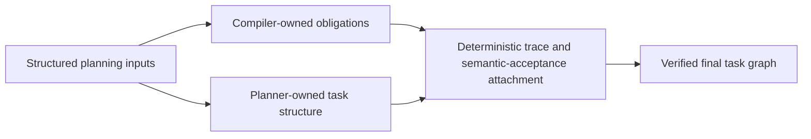

# CAF planning ownership split

This diagram captures the ownership split inside CAF planning.

Use it when you need to explain why CAF does not keep asking the semantic planner to carry every derived artifact.

## Notes

- Ownership splits are one of CAF's primary tools for reducing context load.
- Compiler-owned artifacts should stay mechanical and fail closed when required structured inputs are missing.
- Planner-owned artifacts should stay focused on task structure, dependency shape, and genuinely interpretive planning decisions.
