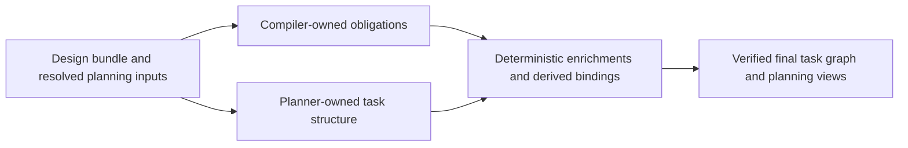

# CAF planning ownership split

This diagram captures the ownership split inside CAF planning.

Use it when you need to explain why CAF does not keep asking the semantic planner to carry every derived artifact. The same split now applies to `/caf ux plan`.

## Notes

- Ownership splits are one of CAF's primary tools for reducing context load.
- Compiler-owned artifacts should stay mechanical and fail closed when required structured inputs are missing.
- Planner-owned artifacts should stay focused on task structure, dependency shape, and genuinely interpretive planning decisions.
- The derived binding and backlog/task-plan views are downstream of that split; they should not be treated as new planner-owned semantic authority surfaces.

## UX lane note

- `/caf ux plan` now follows the same structure: `ux_task_graph_v1.yaml` is semantic/planner-owned, while `ux_task_plan_v1.md` and `ux_task_backlog_v1.md` are deterministic downstream views.
