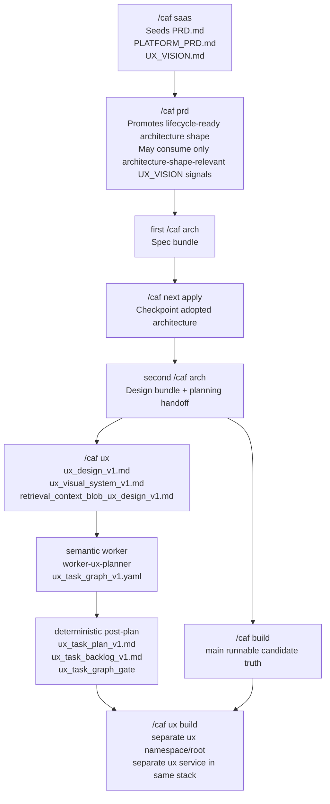

# CAF UX lane workflow

This diagram captures the now-real bounded UX lane and its ownership splits.

Use it when you need to explain:
- where `UX_VISION.md` fits,
- what `/caf ux` derives,
- why `/caf ux plan` now has a semantic worker step,
- why `/caf ux build` depends on the main build lane.

## Notes

- `UX_VISION.md` is a human-owned source artifact; `ux_visual_system_v1.md` is a derived downstream artifact.
- `/caf ux plan` now mirrors CAF planning ownership posture: semantic task shaping first, deterministic projections after.
- `/caf ux build` depends on the main `/caf build` lane for runtime/API truth, but it does not replace the smoke-test UI lane.
