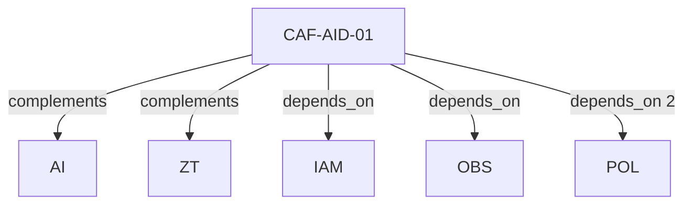

# Pattern graph: AID (v1)

Source: `graphs/pattern_graph_AID_v1.mmd`

Family: **AID**.
Edges to outside families are collapsed to family nodes.

## Links

- [CAF-AID-01](../../architecture_library/patterns/caf_v1/definitions_v1/CAF-AID-01.yaml) — Agent Identity Pattern (Normative Summary)
