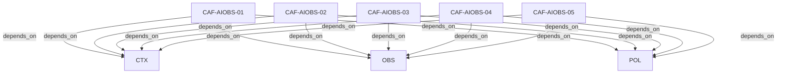

# Pattern graph: AIOBS (v1)

Source: `graphs/pattern_graph_AIOBS_v1.mmd`

Family: **AIOBS**.
Edges to outside families are collapsed to family nodes.

## Links

- [CAF-AIOBS-01](../../architecture_library/patterns/caf_v1/definitions_v1/CAF-AIOBS-01.yaml) — AI Observability Hooks
- [CAF-AIOBS-02](../../architecture_library/patterns/caf_v1/definitions_v1/CAF-AIOBS-02.yaml) — Observability Model for Agents, Models, Tools, and Reasoning Traces
- [CAF-AIOBS-03](../../architecture_library/patterns/caf_v1/definitions_v1/CAF-AIOBS-03.yaml) — Required Telemetry Fields
- [CAF-AIOBS-04](../../architecture_library/patterns/caf_v1/definitions_v1/CAF-AIOBS-04.yaml) — AI Drift Detection and Version Evaluation
- [CAF-AIOBS-05](../../architecture_library/patterns/caf_v1/definitions_v1/CAF-AIOBS-05.yaml) — Multi-Tenant Observability Rules
