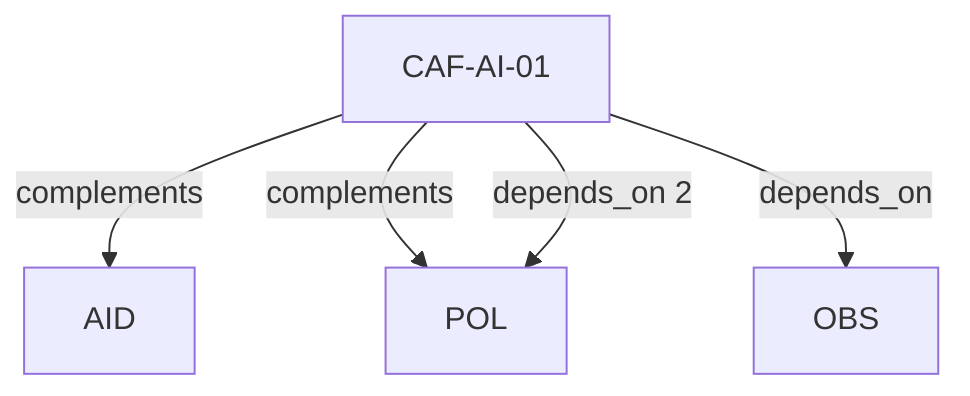

# Pattern graph: AI (v1)

Source: `graphs/pattern_graph_AI_v1.mmd`

Family: **AI**.
Edges to outside families are collapsed to family nodes.

## Links

- [CAF-AI-01](../../architecture_library/patterns/caf_v1/definitions_v1/CAF-AI-01.yaml) — AI Safety and Governance Separation Across Planes
