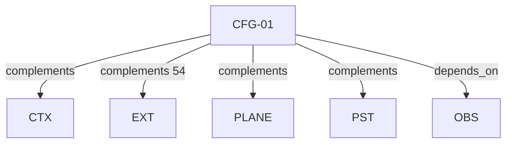

# Pattern graph: CFG (v1)

Source: `graphs/pattern_graph_CFG_v1.mmd`

Family: **CFG**.
Edges to outside families are collapsed to family nodes.

## Links

- [CFG-01](../../architecture_library/patterns/core_v1/definitions_v1/CFG-01.yaml) — Configuration Boundary
