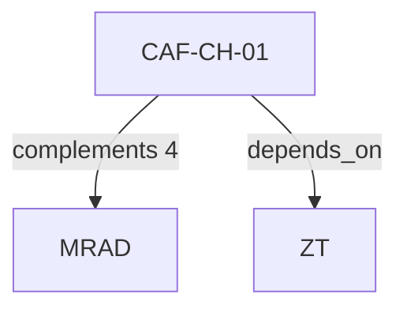

# Pattern graph: CH (v1)

Source: `graphs/pattern_graph_CH_v1.mmd`

Family: **CH**.
Edges to outside families are collapsed to family nodes.

## Links

- [CAF-CH-01](../../architecture_library/patterns/caf_v1/definitions_v1/CAF-CH-01.yaml) — Channel Constraints Do Not Change Plane Authority
