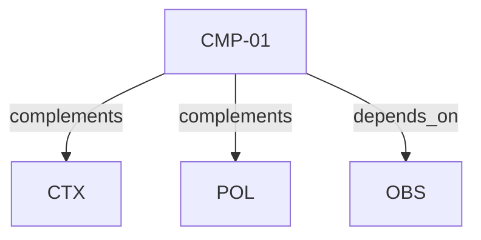

# Pattern graph: CMP (v1)

Source: `graphs/pattern_graph_CMP_v1.mmd`

Family: **CMP**.
Edges to outside families are collapsed to family nodes.

## Links

- [CMP-01](../../architecture_library/patterns/core_v1/definitions_v1/CMP-01.yaml) — Composition Root and Layered Boundaries
