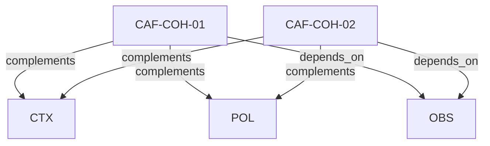

# Pattern graph: COH (v1)

Source: `graphs/pattern_graph_COH_v1.mmd`

Family: **COH**.
Edges to outside families are collapsed to family nodes.

## Links

- [CAF-COH-01](../../architecture_library/patterns/caf_v1/definitions_v1/CAF-COH-01.yaml) — Terminology Consistency
- [CAF-COH-02](../../architecture_library/patterns/caf_v1/definitions_v1/CAF-COH-02.yaml) — Plane Responsibility Integrity
