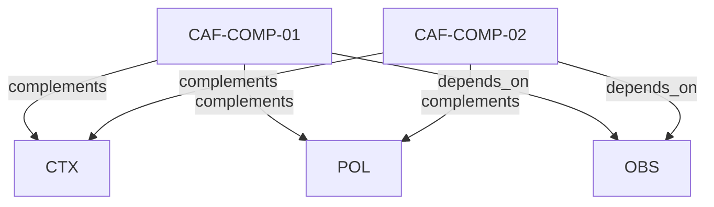

# Pattern graph: COMP (v1)

Source: `graphs/pattern_graph_COMP_v1.mmd`

Family: **COMP**.
Edges to outside families are collapsed to family nodes.

## Links

- [CAF-COMP-01](../../architecture_library/patterns/caf_v1/definitions_v1/CAF-COMP-01.yaml) — Evidence Generation & Traceability
- [CAF-COMP-02](../../architecture_library/patterns/caf_v1/definitions_v1/CAF-COMP-02.yaml) — Failure Modes & Anti-Patterns
