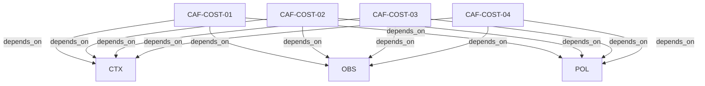

# Pattern graph: COST (v1)

Source: `graphs/pattern_graph_COST_v1.mmd`

Family: **COST**.
Edges to outside families are collapsed to family nodes.

## Links

- [CAF-COST-01](../../architecture_library/patterns/caf_v1/definitions_v1/CAF-COST-01.yaml) — Cost as a First-Class Resource
- [CAF-COST-02](../../architecture_library/patterns/caf_v1/definitions_v1/CAF-COST-02.yaml) — Budgets, Quotas, and Entitlements
- [CAF-COST-03](../../architecture_library/patterns/caf_v1/definitions_v1/CAF-COST-03.yaml) — Runtime Cost Enforcement & Interruption
- [CAF-COST-04](../../architecture_library/patterns/caf_v1/definitions_v1/CAF-COST-04.yaml) — Failure Modes & Anti-Patterns
