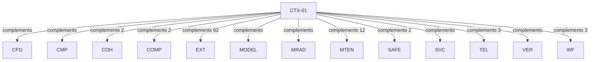

# Pattern graph: CTX (v1)

Source: `graphs/pattern_graph_CTX_v1.mmd`

Family: **CTX**.
Edges to outside families are collapsed to family nodes.

## Links

- [CTX-01](../../architecture_library/patterns/core_v1/definitions_v1/CTX-01.yaml) — Request Context and Propagation
