# Pattern graph: DG (v1)

Source: `graphs/pattern_graph_DG_v1.mmd`

Family: **DG**.
Edges to outside families are collapsed to family nodes.

```mermaid
%% Auto-generated by tools/caf-meta/build_pattern_docs_v1.mjs
graph TD
  P_CAF_DG_01["CAF-DG-01"]
  P_CAF_DG_02["CAF-DG-02"]
  P_CAF_DG_03["CAF-DG-03"]
  P_CAF_DG_04["CAF-DG-04"]
  P_CAF_DG_05["CAF-DG-05"]
  P_CAF_DG_06["CAF-DG-06"]
  P_CAF_DG_07["CAF-DG-07"]
  P_CAF_DG_08["CAF-DG-08"]
  P_CAF_DG_09["CAF-DG-09"]
  P_CAF_DG_10["CAF-DG-10"]
  P_CAF_DG_11["CAF-DG-11"]
  P_CAF_DG_12["CAF-DG-12"]
  P_CAF_DG_13["CAF-DG-13"]
  P_CAF_DG_14["CAF-DG-14"]
  P_CAF_DG_15["CAF-DG-15"]
  P_CAF_DG_16["CAF-DG-16"]
  F_CTX["CTX"]
  F_OBS["OBS"]
  F_POL["POL"]
  P_CAF_DG_01 -->|depends_on| F_CTX
  P_CAF_DG_01 -->|depends_on| F_OBS
  P_CAF_DG_01 -->|depends_on| F_POL
  P_CAF_DG_02 -->|depends_on| F_CTX
  P_CAF_DG_02 -->|depends_on| F_OBS
  P_CAF_DG_02 -->|depends_on| F_POL
  P_CAF_DG_03 -->|depends_on| F_CTX
  P_CAF_DG_03 -->|depends_on| F_OBS
  P_CAF_DG_03 -->|depends_on| F_POL
  P_CAF_DG_04 -->|depends_on| F_CTX
  P_CAF_DG_04 -->|depends_on| F_OBS
  P_CAF_DG_04 -->|depends_on| F_POL
  P_CAF_DG_05 -->|depends_on| F_CTX
  P_CAF_DG_05 -->|depends_on| F_OBS
  P_CAF_DG_05 -->|depends_on| F_POL
  P_CAF_DG_06 -->|depends_on| F_CTX
  P_CAF_DG_06 -->|depends_on| F_OBS
  P_CAF_DG_06 -->|depends_on| F_POL
  P_CAF_DG_07 -->|depends_on| F_CTX
  P_CAF_DG_07 -->|depends_on| F_OBS
  P_CAF_DG_07 -->|depends_on| F_POL
  P_CAF_DG_08 -->|depends_on| F_CTX
  P_CAF_DG_08 -->|depends_on| F_OBS
  P_CAF_DG_08 -->|depends_on| F_POL
  P_CAF_DG_09 -->|depends_on| F_CTX
  P_CAF_DG_09 -->|depends_on| F_OBS
  P_CAF_DG_09 -->|depends_on| F_POL
  P_CAF_DG_10 -->|depends_on| F_CTX
  P_CAF_DG_10 -->|depends_on| F_OBS
  P_CAF_DG_10 -->|depends_on| F_POL
  P_CAF_DG_11 -->|depends_on| F_CTX
  P_CAF_DG_11 -->|depends_on| F_OBS
  P_CAF_DG_11 -->|depends_on| F_POL
  P_CAF_DG_12 -->|depends_on| F_CTX
  P_CAF_DG_12 -->|depends_on| F_OBS
  P_CAF_DG_12 -->|depends_on| F_POL
  P_CAF_DG_13 -->|depends_on| F_CTX
  P_CAF_DG_13 -->|depends_on| F_OBS
  P_CAF_DG_13 -->|depends_on| F_POL
  P_CAF_DG_14 -->|depends_on| F_CTX
  P_CAF_DG_14 -->|depends_on| F_OBS
  P_CAF_DG_14 -->|depends_on| F_POL
  P_CAF_DG_15 -->|depends_on| F_CTX
  P_CAF_DG_15 -->|depends_on| F_OBS
  P_CAF_DG_15 -->|depends_on| F_POL
  P_CAF_DG_16 -->|depends_on| F_CTX
  P_CAF_DG_16 -->|depends_on| F_OBS
  P_CAF_DG_16 -->|depends_on| F_POL
```

## Links

- [CAF-DG-01](../../architecture_library/patterns/caf_v1/definitions_v1/CAF-DG-01.yaml) — Purpose & Role in the Architecture Library
- [CAF-DG-02](../../architecture_library/patterns/caf_v1/definitions_v1/CAF-DG-02.yaml) — Why Data Governance Must Be Architectural
- [CAF-DG-03](../../architecture_library/patterns/caf_v1/definitions_v1/CAF-DG-03.yaml) — Data as a First-Class Governed Asset
- [CAF-DG-04](../../architecture_library/patterns/caf_v1/definitions_v1/CAF-DG-04.yaml) — Data Governance Responsibilities Across the Tri-Plane Architecture
- [CAF-DG-05](../../architecture_library/patterns/caf_v1/definitions_v1/CAF-DG-05.yaml) — Data Classification and Sensitivity Domains
- [CAF-DG-06](../../architecture_library/patterns/caf_v1/definitions_v1/CAF-DG-06.yaml) — Data Quality Dimensions and Invariants
- [CAF-DG-07](../../architecture_library/patterns/caf_v1/definitions_v1/CAF-DG-07.yaml) — Data Lifecycle Governance (Creation to Deletion)
- [CAF-DG-08](../../architecture_library/patterns/caf_v1/definitions_v1/CAF-DG-08.yaml) — Design-Time Data Governance (ADR Integration)
- [CAF-DG-09](../../architecture_library/patterns/caf_v1/definitions_v1/CAF-DG-09.yaml) — Runtime Data Validation and Enforcement
- [CAF-DG-10](../../architecture_library/patterns/caf_v1/definitions_v1/CAF-DG-10.yaml) — AI and Agent Data Usage Constraints
- [CAF-DG-11](../../architecture_library/patterns/caf_v1/definitions_v1/CAF-DG-11.yaml) — Integration with Policy Engine
- [CAF-DG-12](../../architecture_library/patterns/caf_v1/definitions_v1/CAF-DG-12.yaml) — Integration with Compliance Automation
- [CAF-DG-13](../../architecture_library/patterns/caf_v1/definitions_v1/CAF-DG-13.yaml) — Data Observability, Lineage, and Trust Signals
- [CAF-DG-14](../../architecture_library/patterns/caf_v1/definitions_v1/CAF-DG-14.yaml) — Failure Modes & Anti-Patterns
- [CAF-DG-15](../../architecture_library/patterns/caf_v1/definitions_v1/CAF-DG-15.yaml) — Evolution, Migration, and Backward Compatibility
- [CAF-DG-16](../../architecture_library/patterns/caf_v1/definitions_v1/CAF-DG-16.yaml) — Version History
