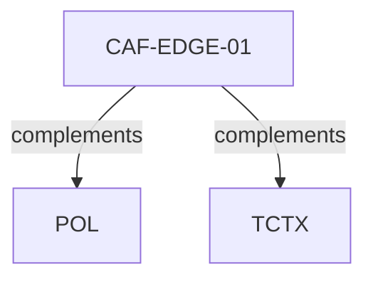

# Pattern graph: EDGE (v1)

Source: `graphs/pattern_graph_EDGE_v1.mmd`

Family: **EDGE**.
Edges to outside families are collapsed to family nodes.

## Links

- [CAF-EDGE-01](../../architecture_library/patterns/caf_v1/definitions_v1/CAF-EDGE-01.yaml) — Backend-for-Frontend (BFF) / API Composition Boundary
