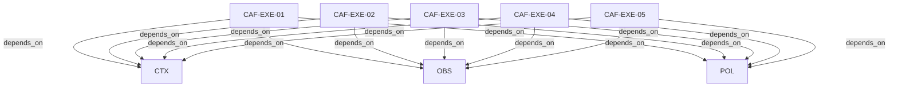

# Pattern graph: EXE (v1)

Source: `graphs/pattern_graph_EXE_v1.mmd`

Family: **EXE**.
Edges to outside families are collapsed to family nodes.

## Links

- [CAF-EXE-01](../../architecture_library/patterns/caf_v1/definitions_v1/CAF-EXE-01.yaml) — Contura Enforcement Chain
- [CAF-EXE-02](../../architecture_library/patterns/caf_v1/definitions_v1/CAF-EXE-02.yaml) — Artifact Types and Roles
- [CAF-EXE-03](../../architecture_library/patterns/caf_v1/definitions_v1/CAF-EXE-03.yaml) — Mapping Requirements to Checks
- [CAF-EXE-04](../../architecture_library/patterns/caf_v1/definitions_v1/CAF-EXE-04.yaml) — Minimum Evidence Bundle
- [CAF-EXE-05](../../architecture_library/patterns/caf_v1/definitions_v1/CAF-EXE-05.yaml) — Non-Goals and Anti-Patterns
