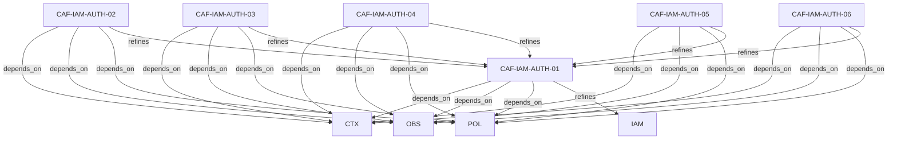

# Pattern graph: IAM:AUTH (v1)

Source: `graphs/pattern_graph_IAM_AUTH_v1.mmd`

Family: **IAM** (subfamily: **AUTH**).
Edges to outside families are collapsed to family nodes.

## Links

- [CAF-IAM-AUTH-01](../../architecture_library/patterns/caf_v1/definitions_v1/CAF-IAM-AUTH-01.yaml) — Authentication Validation
- [CAF-IAM-AUTH-02](../../architecture_library/patterns/caf_v1/definitions_v1/CAF-IAM-AUTH-02.yaml) — Delegated Authorization Enforcement
- [CAF-IAM-AUTH-03](../../architecture_library/patterns/caf_v1/definitions_v1/CAF-IAM-AUTH-03.yaml) — Tenant-Context–Aware Authorization
- [CAF-IAM-AUTH-04](../../architecture_library/patterns/caf_v1/definitions_v1/CAF-IAM-AUTH-04.yaml) — Runtime Policy Consumption
- [CAF-IAM-AUTH-05](../../architecture_library/patterns/caf_v1/definitions_v1/CAF-IAM-AUTH-05.yaml) — Agent and Service Authorization
- [CAF-IAM-AUTH-06](../../architecture_library/patterns/caf_v1/definitions_v1/CAF-IAM-AUTH-06.yaml) — Failure Handling and Denial
