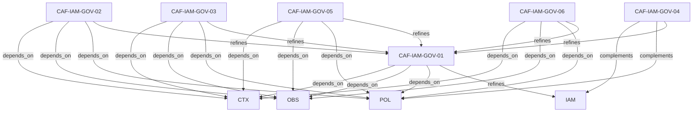

# Pattern graph: IAM:GOV (v1)

Source: `graphs/pattern_graph_IAM_GOV_v1.mmd`

Family: **IAM** (subfamily: **GOV**).
Edges to outside families are collapsed to family nodes.

## Links

- [CAF-IAM-GOV-01](../../architecture_library/patterns/caf_v1/definitions_v1/CAF-IAM-GOV-01.yaml) — Centralized Identity Authority
- [CAF-IAM-GOV-02](../../architecture_library/patterns/caf_v1/definitions_v1/CAF-IAM-GOV-02.yaml) — Tenant-Scoped Identity Governance
- [CAF-IAM-GOV-03](../../architecture_library/patterns/caf_v1/definitions_v1/CAF-IAM-GOV-03.yaml) — Identity Integration Governance
- [CAF-IAM-GOV-04](../../architecture_library/patterns/caf_v1/definitions_v1/CAF-IAM-GOV-04.yaml) — Policy Intent Definition
- [CAF-IAM-GOV-05](../../architecture_library/patterns/caf_v1/definitions_v1/CAF-IAM-GOV-05.yaml) — Identity Lifecycle Governance
- [CAF-IAM-GOV-06](../../architecture_library/patterns/caf_v1/definitions_v1/CAF-IAM-GOV-06.yaml) — Delegated Enforcement Boundary
