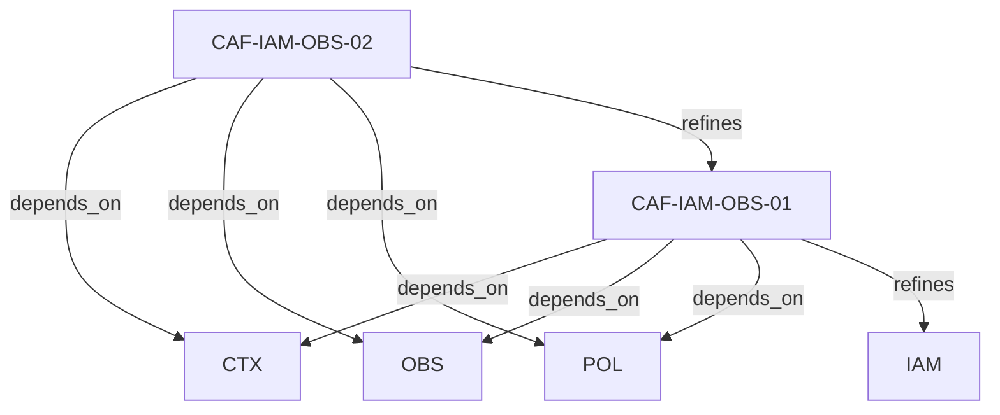

# Pattern graph: IAM:OBS (v1)

Source: `graphs/pattern_graph_IAM_OBS_v1.mmd`

Family: **IAM** (subfamily: **OBS**).
Edges to outside families are collapsed to family nodes.

## Links

- [CAF-IAM-OBS-01](../../architecture_library/patterns/caf_v1/definitions_v1/CAF-IAM-OBS-01.yaml) — Identity Attribution
- [CAF-IAM-OBS-02](../../architecture_library/patterns/caf_v1/definitions_v1/CAF-IAM-OBS-02.yaml) — End-to-End Traceability
