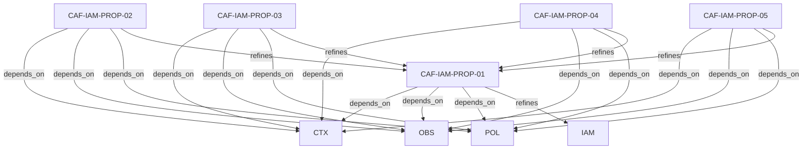

# Pattern graph: IAM:PROP (v1)

Source: `graphs/pattern_graph_IAM_PROP_v1.mmd`

Family: **IAM** (subfamily: **PROP**).
Edges to outside families are collapsed to family nodes.

## Links

- [CAF-IAM-PROP-01](../../architecture_library/patterns/caf_v1/definitions_v1/CAF-IAM-PROP-01.yaml) — Revocation and Change Propagation
- [CAF-IAM-PROP-02](../../architecture_library/patterns/caf_v1/definitions_v1/CAF-IAM-PROP-02.yaml) — No Transitive Authority
- [CAF-IAM-PROP-03](../../architecture_library/patterns/caf_v1/definitions_v1/CAF-IAM-PROP-03.yaml) — Policy Signals vs Control Signals
- [CAF-IAM-PROP-04](../../architecture_library/patterns/caf_v1/definitions_v1/CAF-IAM-PROP-04.yaml) — No Implicit Trust Between Planes
- [CAF-IAM-PROP-05](../../architecture_library/patterns/caf_v1/definitions_v1/CAF-IAM-PROP-05.yaml) — Explicit Identity Verification
