# Pattern graph: IAM (v1)

Source: `graphs/pattern_graph_IAM_v1.mmd`

Family: **IAM**.
Edges to outside families are collapsed to family nodes.

```mermaid
%% Auto-generated by tools/caf-meta/build_pattern_docs_v1.mjs
graph TD
  SF_IAM_AUTH["IAM:AUTH"]
  SF_IAM_GOV["IAM:GOV"]
  SF_IAM_OBS["IAM:OBS"]
  SF_IAM_PROP["IAM:PROP"]
  SF_IAM_ROOT["IAM:ROOT"]
  F_AID["AID"]
  F_CTX["CTX"]
  F_MODEL["MODEL"]
  F_MTEN["MTEN"]
  F_OBS["OBS"]
  F_PLANE["PLANE"]
  F_POL["POL"]
  F_TCTX["TCTX"]
  F_XPLANE["XPLANE"]
  F_ZT["ZT"]
  SF_IAM_AUTH -->|depends_on 6| F_CTX
  SF_IAM_AUTH -->|depends_on 6| F_OBS
  SF_IAM_AUTH -->|depends_on 6| F_POL
  SF_IAM_GOV -->|complements| F_POL
  SF_IAM_GOV -->|depends_on 5| F_CTX
  SF_IAM_GOV -->|depends_on 5| F_OBS
  SF_IAM_GOV -->|depends_on 5| F_POL
  SF_IAM_OBS -->|depends_on 2| F_CTX
  SF_IAM_OBS -->|depends_on 2| F_OBS
  SF_IAM_OBS -->|depends_on 2| F_POL
  SF_IAM_PROP -->|depends_on 5| F_CTX
  SF_IAM_PROP -->|depends_on 5| F_OBS
  SF_IAM_PROP -->|depends_on 5| F_POL
  SF_IAM_ROOT -->|complements| F_AID
  SF_IAM_ROOT -->|complements| F_MODEL
  SF_IAM_ROOT -->|complements| F_MTEN
  SF_IAM_ROOT -->|complements| F_PLANE
  SF_IAM_ROOT -->|complements 3| F_POL
  SF_IAM_ROOT -->|complements| F_TCTX
  SF_IAM_ROOT -->|complements 2| F_XPLANE
  SF_IAM_ROOT -->|complements 3| F_ZT
  SF_IAM_ROOT -->|depends_on 9| F_CTX
  SF_IAM_ROOT -->|depends_on 11| F_OBS
  SF_IAM_ROOT -->|depends_on 9| F_POL
  SF_IAM_AUTH -->|refines 5| SF_IAM_AUTH
  SF_IAM_AUTH -->|refines| SF_IAM_ROOT
  SF_IAM_GOV -->|complements| SF_IAM_ROOT
  SF_IAM_GOV -->|refines 5| SF_IAM_GOV
  SF_IAM_GOV -->|refines| SF_IAM_ROOT
  SF_IAM_OBS -->|refines| SF_IAM_OBS
  SF_IAM_OBS -->|refines| SF_IAM_ROOT
  SF_IAM_PROP -->|refines 4| SF_IAM_PROP
  SF_IAM_PROP -->|refines| SF_IAM_ROOT
  SF_IAM_ROOT -->|complements| SF_IAM_GOV
  SF_IAM_ROOT -->|depends_on| SF_IAM_ROOT
  SF_IAM_ROOT -->|refines 10| SF_IAM_ROOT
```

## Links

- [IAM:AUTH](pattern_graph_IAM_AUTH_v1.md)
- [IAM:GOV](pattern_graph_IAM_GOV_v1.md)
- [IAM:OBS](pattern_graph_IAM_OBS_v1.md)
- [IAM:PROP](pattern_graph_IAM_PROP_v1.md)
- [IAM:ROOT](pattern_graph_IAM_ROOT_v1.md)
