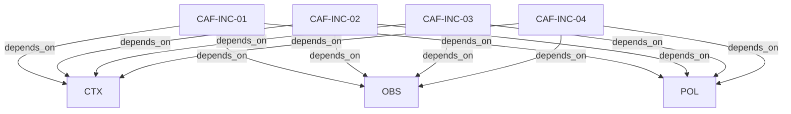

# Pattern graph: INC (v1)

Source: `graphs/pattern_graph_INC_v1.mmd`

Family: **INC**.
Edges to outside families are collapsed to family nodes.

## Links

- [CAF-INC-01](../../architecture_library/patterns/caf_v1/definitions_v1/CAF-INC-01.yaml) — Severity Levels (Operational)
- [CAF-INC-02](../../architecture_library/patterns/caf_v1/definitions_v1/CAF-INC-02.yaml) — Primary Incident Classes → Checklist Mapping
- [CAF-INC-03](../../architecture_library/patterns/caf_v1/definitions_v1/CAF-INC-03.yaml) — Triage Playbook (Fast Path)
- [CAF-INC-04](../../architecture_library/patterns/caf_v1/definitions_v1/CAF-INC-04.yaml) — Post-Incident Requirements
