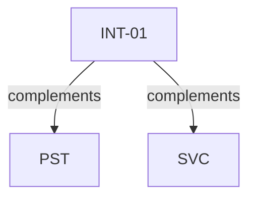

# Pattern graph: INT (v1)

Source: `graphs/pattern_graph_INT_v1.mmd`

Family: **INT**.
Edges to outside families are collapsed to family nodes.

## Links

- [INT-01](../../architecture_library/patterns/core_v1/definitions_v1/INT-01.yaml) — External Integration Adapter Boundary
