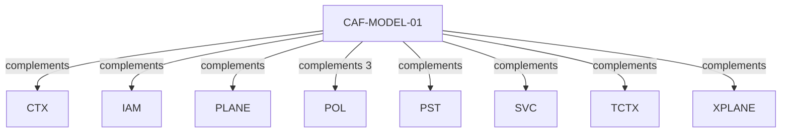

# Pattern graph: MODEL (v1)

Source: `graphs/pattern_graph_MODEL_v1.mmd`

Family: **MODEL**.
Edges to outside families are collapsed to family nodes.

## Links

- [CAF-MODEL-01](../../architecture_library/patterns/caf_v1/definitions_v1/CAF-MODEL-01.yaml) — Domain Modeling Framework Selection (DDD + Clean Architecture Default)
