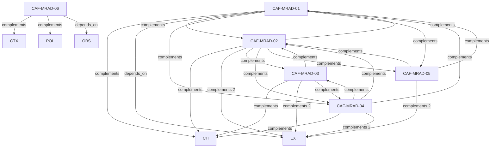

# Pattern graph: MRAD (v1)

Source: `graphs/pattern_graph_MRAD_v1.mmd`

Family: **MRAD**.
Edges to outside families are collapsed to family nodes.

## Links

- [CAF-MRAD-01](../../architecture_library/patterns/caf_v1/definitions_v1/CAF-MRAD-01.yaml) — MRAD-1 Idempotent Command Pattern
- [CAF-MRAD-02](../../architecture_library/patterns/caf_v1/definitions_v1/CAF-MRAD-02.yaml) — MRAD-2 Resumable Workflow Pattern
- [CAF-MRAD-03](../../architecture_library/patterns/caf_v1/definitions_v1/CAF-MRAD-03.yaml) — MRAD-3 Bounded Payload and Collection Pattern
- [CAF-MRAD-04](../../architecture_library/patterns/caf_v1/definitions_v1/CAF-MRAD-04.yaml) — MRAD-4 Coarse-Grained Interaction Pattern
- [CAF-MRAD-05](../../architecture_library/patterns/caf_v1/definitions_v1/CAF-MRAD-05.yaml) — MRAD-5 Offline/Degraded Mode Pattern
- [CAF-MRAD-06](../../architecture_library/patterns/caf_v1/definitions_v1/CAF-MRAD-06.yaml) — Background Execution Constraint
