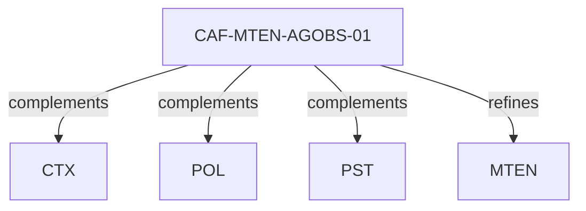

# Pattern graph: MTEN:AGOBS (v1)

Source: `graphs/pattern_graph_MTEN_AGOBS_v1.mmd`

Family: **MTEN** (subfamily: **AGOBS**).
Edges to outside families are collapsed to family nodes.

## Links

- [CAF-MTEN-AGOBS-01](../../architecture_library/patterns/caf_v1/definitions_v1/CAF-MTEN-AGOBS-01.yaml) — Observability for Agents and Autonomous Execution
