# Pattern graph: MTEN:ANTI (v1)

Source: `graphs/pattern_graph_MTEN_ANTI_v1.mmd`

Family: **MTEN** (subfamily: **ANTI**).
Edges to outside families are collapsed to family nodes.

```mermaid
%% Auto-generated by tools/caf-meta/build_pattern_docs_v1.mjs
graph TD
  P_CAF_MTEN_ANTI_01["CAF-MTEN-ANTI-01"]
  P_CAF_MTEN_ANTI_02["CAF-MTEN-ANTI-02"]
  P_CAF_MTEN_ANTI_03["CAF-MTEN-ANTI-03"]
  P_CAF_MTEN_ANTI_04["CAF-MTEN-ANTI-04"]
  P_CAF_MTEN_ANTI_05["CAF-MTEN-ANTI-05"]
  P_CAF_MTEN_ANTI_06["CAF-MTEN-ANTI-06"]
  P_CAF_MTEN_ANTI_07["CAF-MTEN-ANTI-07"]
  P_CAF_MTEN_ANTI_08["CAF-MTEN-ANTI-08"]
  F_CTX["CTX"]
  F_MTEN["MTEN"]
  F_POL["POL"]
  F_PST["PST"]
  P_CAF_MTEN_ANTI_01 -->|complements| F_PST
  P_CAF_MTEN_ANTI_01 -->|depends_on| F_CTX
  P_CAF_MTEN_ANTI_01 -->|depends_on| F_POL
  P_CAF_MTEN_ANTI_01 -->|refines| F_MTEN
  P_CAF_MTEN_ANTI_02 -->|complements| F_PST
  P_CAF_MTEN_ANTI_02 -->|depends_on| F_CTX
  P_CAF_MTEN_ANTI_02 -->|depends_on| F_POL
  P_CAF_MTEN_ANTI_02 -->|refines| F_MTEN
  P_CAF_MTEN_ANTI_03 -->|complements| F_PST
  P_CAF_MTEN_ANTI_03 -->|depends_on| F_CTX
  P_CAF_MTEN_ANTI_03 -->|depends_on| F_POL
  P_CAF_MTEN_ANTI_03 -->|refines| F_MTEN
  P_CAF_MTEN_ANTI_04 -->|complements| F_PST
  P_CAF_MTEN_ANTI_04 -->|depends_on| F_CTX
  P_CAF_MTEN_ANTI_04 -->|depends_on| F_POL
  P_CAF_MTEN_ANTI_04 -->|refines| F_MTEN
  P_CAF_MTEN_ANTI_05 -->|complements| F_PST
  P_CAF_MTEN_ANTI_05 -->|depends_on| F_CTX
  P_CAF_MTEN_ANTI_05 -->|depends_on| F_POL
  P_CAF_MTEN_ANTI_05 -->|refines| F_MTEN
  P_CAF_MTEN_ANTI_06 -->|complements| F_PST
  P_CAF_MTEN_ANTI_06 -->|depends_on| F_CTX
  P_CAF_MTEN_ANTI_06 -->|depends_on| F_POL
  P_CAF_MTEN_ANTI_06 -->|refines| F_MTEN
  P_CAF_MTEN_ANTI_07 -->|complements| F_PST
  P_CAF_MTEN_ANTI_07 -->|depends_on| F_CTX
  P_CAF_MTEN_ANTI_07 -->|depends_on| F_POL
  P_CAF_MTEN_ANTI_07 -->|refines| F_MTEN
  P_CAF_MTEN_ANTI_08 -->|complements| F_PST
  P_CAF_MTEN_ANTI_08 -->|depends_on| F_CTX
  P_CAF_MTEN_ANTI_08 -->|depends_on| F_POL
  P_CAF_MTEN_ANTI_08 -->|refines| F_MTEN
```

## Links

- [CAF-MTEN-ANTI-01](../../architecture_library/patterns/caf_v1/definitions_v1/CAF-MTEN-ANTI-01.yaml) — Implicit Tenancy
- [CAF-MTEN-ANTI-02](../../architecture_library/patterns/caf_v1/definitions_v1/CAF-MTEN-ANTI-02.yaml) — Treating Workspaces (or Projects) as Tenants
- [CAF-MTEN-ANTI-03](../../architecture_library/patterns/caf_v1/definitions_v1/CAF-MTEN-ANTI-03.yaml) — Coupling Billing, Authorization, and Isolation
- [CAF-MTEN-ANTI-04](../../architecture_library/patterns/caf_v1/definitions_v1/CAF-MTEN-ANTI-04.yaml) — Identity Without Tenant Scope
- [CAF-MTEN-ANTI-05](../../architecture_library/patterns/caf_v1/definitions_v1/CAF-MTEN-ANTI-05.yaml) — Treating Enterprise as a Fork
- [CAF-MTEN-ANTI-06](../../architecture_library/patterns/caf_v1/definitions_v1/CAF-MTEN-ANTI-06.yaml) — Late Introduction of Governance
- [CAF-MTEN-ANTI-07](../../architecture_library/patterns/caf_v1/definitions_v1/CAF-MTEN-ANTI-07.yaml) — Agent Autonomy Without Boundaries
- [CAF-MTEN-ANTI-08](../../architecture_library/patterns/caf_v1/definitions_v1/CAF-MTEN-ANTI-08.yaml) — Assuming Network Isolation Is Sufficient
