# Pattern graph: MTEN:COST (v1)

Source: `graphs/pattern_graph_MTEN_COST_v1.mmd`

Family: **MTEN** (subfamily: **COST**).
Edges to outside families are collapsed to family nodes.

```mermaid
%% Auto-generated by tools/caf-meta/build_pattern_docs_v1.mjs
graph TD
  P_CAF_MTEN_COST_01["CAF-MTEN-COST-01"]
  P_CAF_MTEN_COST_02["CAF-MTEN-COST-02"]
  P_CAF_MTEN_COST_03["CAF-MTEN-COST-03"]
  P_CAF_MTEN_COST_04["CAF-MTEN-COST-04"]
  P_CAF_MTEN_COST_05["CAF-MTEN-COST-05"]
  F_CTX["CTX"]
  F_MTEN["MTEN"]
  F_POL["POL"]
  F_PST["PST"]
  P_CAF_MTEN_COST_01 -->|complements| F_PST
  P_CAF_MTEN_COST_01 -->|depends_on| F_CTX
  P_CAF_MTEN_COST_01 -->|depends_on| F_POL
  P_CAF_MTEN_COST_01 -->|refines| F_MTEN
  P_CAF_MTEN_COST_02 -->|complements| F_PST
  P_CAF_MTEN_COST_02 -->|depends_on| F_CTX
  P_CAF_MTEN_COST_02 -->|depends_on| F_POL
  P_CAF_MTEN_COST_02 -->|refines| F_MTEN
  P_CAF_MTEN_COST_03 -->|complements| F_PST
  P_CAF_MTEN_COST_03 -->|depends_on| F_CTX
  P_CAF_MTEN_COST_03 -->|depends_on| F_POL
  P_CAF_MTEN_COST_03 -->|refines| F_MTEN
  P_CAF_MTEN_COST_04 -->|complements| F_PST
  P_CAF_MTEN_COST_04 -->|depends_on| F_CTX
  P_CAF_MTEN_COST_04 -->|depends_on| F_POL
  P_CAF_MTEN_COST_04 -->|refines| F_MTEN
  P_CAF_MTEN_COST_05 -->|complements| F_PST
  P_CAF_MTEN_COST_05 -->|depends_on| F_CTX
  P_CAF_MTEN_COST_05 -->|depends_on| F_POL
  P_CAF_MTEN_COST_05 -->|refines| F_MTEN
```

## Links

- [CAF-MTEN-COST-01](../../architecture_library/patterns/caf_v1/definitions_v1/CAF-MTEN-COST-01.yaml) — Metering as a First-Class Execution Step
- [CAF-MTEN-COST-02](../../architecture_library/patterns/caf_v1/definitions_v1/CAF-MTEN-COST-02.yaml) — Enforcement Before Execution
- [CAF-MTEN-COST-03](../../architecture_library/patterns/caf_v1/definitions_v1/CAF-MTEN-COST-03.yaml) — Enforcement During Execution
- [CAF-MTEN-COST-04](../../architecture_library/patterns/caf_v1/definitions_v1/CAF-MTEN-COST-04.yaml) — AccountScope as Enforcement Authority
- [CAF-MTEN-COST-05](../../architecture_library/patterns/caf_v1/definitions_v1/CAF-MTEN-COST-05.yaml) — Graceful Degradation Patterns
