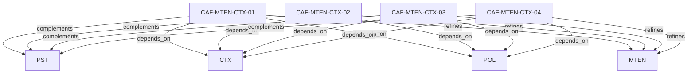

# Pattern graph: MTEN:CTX (v1)

Source: `graphs/pattern_graph_MTEN_CTX_v1.mmd`

Family: **MTEN** (subfamily: **CTX**).
Edges to outside families are collapsed to family nodes.

## Links

- [CAF-MTEN-CTX-01](../../architecture_library/patterns/caf_v1/definitions_v1/CAF-MTEN-CTX-01.yaml) — Context Binding Patterns
- [CAF-MTEN-CTX-02](../../architecture_library/patterns/caf_v1/definitions_v1/CAF-MTEN-CTX-02.yaml) — Context Propagation Patterns
- [CAF-MTEN-CTX-03](../../architecture_library/patterns/caf_v1/definitions_v1/CAF-MTEN-CTX-03.yaml) — Context Enforcement Patterns
- [CAF-MTEN-CTX-04](../../architecture_library/patterns/caf_v1/definitions_v1/CAF-MTEN-CTX-04.yaml) — Context Validation & Defense-in-Depth
