# Pattern graph: MTEN:ENT (v1)

Source: `graphs/pattern_graph_MTEN_ENT_v1.mmd`

Family: **MTEN** (subfamily: **ENT**).
Edges to outside families are collapsed to family nodes.

```mermaid
%% Auto-generated by tools/caf-meta/build_pattern_docs_v1.mjs
graph TD
  P_CAF_MTEN_ENT_01["CAF-MTEN-ENT-01"]
  P_CAF_MTEN_ENT_02["CAF-MTEN-ENT-02"]
  P_CAF_MTEN_ENT_03["CAF-MTEN-ENT-03"]
  P_CAF_MTEN_ENT_04["CAF-MTEN-ENT-04"]
  P_CAF_MTEN_ENT_05["CAF-MTEN-ENT-05"]
  P_CAF_MTEN_ENT_06["CAF-MTEN-ENT-06"]
  P_CAF_MTEN_ENT_07["CAF-MTEN-ENT-07"]
  P_CAF_MTEN_ENT_08["CAF-MTEN-ENT-08"]
  P_CAF_MTEN_ENT_09["CAF-MTEN-ENT-09"]
  P_CAF_MTEN_ENT_10["CAF-MTEN-ENT-10"]
  F_CTX["CTX"]
  F_MTEN["MTEN"]
  F_POL["POL"]
  F_PST["PST"]
  P_CAF_MTEN_ENT_01 -->|complements| F_PST
  P_CAF_MTEN_ENT_01 -->|depends_on| F_CTX
  P_CAF_MTEN_ENT_01 -->|depends_on| F_POL
  P_CAF_MTEN_ENT_01 -->|refines| F_MTEN
  P_CAF_MTEN_ENT_02 -->|complements| F_PST
  P_CAF_MTEN_ENT_02 -->|depends_on| F_CTX
  P_CAF_MTEN_ENT_02 -->|depends_on| F_POL
  P_CAF_MTEN_ENT_02 -->|refines| F_MTEN
  P_CAF_MTEN_ENT_03 -->|complements| F_PST
  P_CAF_MTEN_ENT_03 -->|depends_on| F_CTX
  P_CAF_MTEN_ENT_03 -->|depends_on| F_POL
  P_CAF_MTEN_ENT_03 -->|refines| F_MTEN
  P_CAF_MTEN_ENT_04 -->|complements| F_PST
  P_CAF_MTEN_ENT_04 -->|depends_on| F_CTX
  P_CAF_MTEN_ENT_04 -->|depends_on| F_POL
  P_CAF_MTEN_ENT_04 -->|refines| F_MTEN
  P_CAF_MTEN_ENT_05 -->|complements| F_PST
  P_CAF_MTEN_ENT_05 -->|depends_on| F_CTX
  P_CAF_MTEN_ENT_05 -->|depends_on| F_POL
  P_CAF_MTEN_ENT_05 -->|refines| F_MTEN
  P_CAF_MTEN_ENT_06 -->|complements| F_PST
  P_CAF_MTEN_ENT_06 -->|depends_on| F_CTX
  P_CAF_MTEN_ENT_06 -->|depends_on| F_POL
  P_CAF_MTEN_ENT_06 -->|refines| F_MTEN
  P_CAF_MTEN_ENT_07 -->|complements| F_PST
  P_CAF_MTEN_ENT_07 -->|depends_on| F_CTX
  P_CAF_MTEN_ENT_07 -->|depends_on| F_POL
  P_CAF_MTEN_ENT_07 -->|refines| F_MTEN
  P_CAF_MTEN_ENT_08 -->|complements| F_PST
  P_CAF_MTEN_ENT_08 -->|depends_on| F_CTX
  P_CAF_MTEN_ENT_08 -->|depends_on| F_POL
  P_CAF_MTEN_ENT_08 -->|refines| F_MTEN
  P_CAF_MTEN_ENT_09 -->|complements| F_PST
  P_CAF_MTEN_ENT_09 -->|depends_on| F_CTX
  P_CAF_MTEN_ENT_09 -->|depends_on| F_POL
  P_CAF_MTEN_ENT_09 -->|refines| F_MTEN
  P_CAF_MTEN_ENT_10 -->|complements| F_PST
  P_CAF_MTEN_ENT_10 -->|depends_on| F_CTX
  P_CAF_MTEN_ENT_10 -->|depends_on| F_POL
  P_CAF_MTEN_ENT_10 -->|refines| F_MTEN
```

## Links

- [CAF-MTEN-ENT-01](../../architecture_library/patterns/caf_v1/definitions_v1/CAF-MTEN-ENT-01.yaml) — Enterprise Is a Mode, Not a Different Architecture
- [CAF-MTEN-ENT-02](../../architecture_library/patterns/caf_v1/definitions_v1/CAF-MTEN-ENT-02.yaml) — Enterprise Drivers and Architectural Pressure
- [CAF-MTEN-ENT-03](../../architecture_library/patterns/caf_v1/definitions_v1/CAF-MTEN-ENT-03.yaml) — Compliance Modes as Explicit Policy
- [CAF-MTEN-ENT-04](../../architecture_library/patterns/caf_v1/definitions_v1/CAF-MTEN-ENT-04.yaml) — Isolation Evolution Under Enterprise Modes
- [CAF-MTEN-ENT-05](../../architecture_library/patterns/caf_v1/definitions_v1/CAF-MTEN-ENT-05.yaml) — Identity, Operator Access, and Enterprise Governance
- [CAF-MTEN-ENT-06](../../architecture_library/patterns/caf_v1/definitions_v1/CAF-MTEN-ENT-06.yaml) — Data Residency and Sovereignty Modes
- [CAF-MTEN-ENT-07](../../architecture_library/patterns/caf_v1/definitions_v1/CAF-MTEN-ENT-07.yaml) — Audit, Retention, and Legal Hold Patterns
- [CAF-MTEN-ENT-08](../../architecture_library/patterns/caf_v1/definitions_v1/CAF-MTEN-ENT-08.yaml) — AI, Agents, and Enterprise Risk Profiles
- [CAF-MTEN-ENT-09](../../architecture_library/patterns/caf_v1/definitions_v1/CAF-MTEN-ENT-09.yaml) — Cost, Contracts, and Predictability
- [CAF-MTEN-ENT-10](../../architecture_library/patterns/caf_v1/definitions_v1/CAF-MTEN-ENT-10.yaml) — Evolution Without Fragmentation
