# Pattern graph: MTEN:EVAL (v1)

Source: `graphs/pattern_graph_MTEN_EVAL_v1.mmd`

Family: **MTEN** (subfamily: **EVAL**).
Edges to outside families are collapsed to family nodes.

```mermaid
%% Auto-generated by tools/caf-meta/build_pattern_docs_v1.mjs
graph TD
  P_CAF_MTEN_EVAL_01["CAF-MTEN-EVAL-01"]
  P_CAF_MTEN_EVAL_02["CAF-MTEN-EVAL-02"]
  P_CAF_MTEN_EVAL_03["CAF-MTEN-EVAL-03"]
  P_CAF_MTEN_EVAL_04["CAF-MTEN-EVAL-04"]
  P_CAF_MTEN_EVAL_05["CAF-MTEN-EVAL-05"]
  P_CAF_MTEN_EVAL_06["CAF-MTEN-EVAL-06"]
  P_CAF_MTEN_EVAL_07["CAF-MTEN-EVAL-07"]
  P_CAF_MTEN_EVAL_08["CAF-MTEN-EVAL-08"]
  P_CAF_MTEN_EVAL_09["CAF-MTEN-EVAL-09"]
  P_CAF_MTEN_EVAL_10["CAF-MTEN-EVAL-10"]
  P_CAF_MTEN_EVAL_11["CAF-MTEN-EVAL-11"]
  P_CAF_MTEN_EVAL_12["CAF-MTEN-EVAL-12"]
  P_CAF_MTEN_EVAL_13["CAF-MTEN-EVAL-13"]
  P_CAF_MTEN_EVAL_14["CAF-MTEN-EVAL-14"]
  P_CAF_MTEN_EVAL_15["CAF-MTEN-EVAL-15"]
  F_CTX["CTX"]
  F_MTEN["MTEN"]
  F_POL["POL"]
  F_PST["PST"]
  P_CAF_MTEN_EVAL_01 -->|complements| F_PST
  P_CAF_MTEN_EVAL_01 -->|depends_on| F_CTX
  P_CAF_MTEN_EVAL_01 -->|depends_on| F_POL
  P_CAF_MTEN_EVAL_01 -->|refines| F_MTEN
  P_CAF_MTEN_EVAL_02 -->|complements| F_PST
  P_CAF_MTEN_EVAL_02 -->|depends_on| F_CTX
  P_CAF_MTEN_EVAL_02 -->|depends_on| F_POL
  P_CAF_MTEN_EVAL_02 -->|refines| F_MTEN
  P_CAF_MTEN_EVAL_03 -->|complements| F_PST
  P_CAF_MTEN_EVAL_03 -->|depends_on| F_CTX
  P_CAF_MTEN_EVAL_03 -->|depends_on| F_POL
  P_CAF_MTEN_EVAL_03 -->|refines| F_MTEN
  P_CAF_MTEN_EVAL_04 -->|complements| F_PST
  P_CAF_MTEN_EVAL_04 -->|depends_on| F_CTX
  P_CAF_MTEN_EVAL_04 -->|depends_on| F_POL
  P_CAF_MTEN_EVAL_04 -->|refines| F_MTEN
  P_CAF_MTEN_EVAL_05 -->|complements| F_PST
  P_CAF_MTEN_EVAL_05 -->|depends_on| F_CTX
  P_CAF_MTEN_EVAL_05 -->|depends_on| F_POL
  P_CAF_MTEN_EVAL_05 -->|refines| F_MTEN
  P_CAF_MTEN_EVAL_06 -->|complements| F_PST
  P_CAF_MTEN_EVAL_06 -->|depends_on| F_CTX
  P_CAF_MTEN_EVAL_06 -->|depends_on| F_POL
  P_CAF_MTEN_EVAL_06 -->|refines| F_MTEN
  P_CAF_MTEN_EVAL_07 -->|complements| F_PST
  P_CAF_MTEN_EVAL_07 -->|depends_on| F_CTX
  P_CAF_MTEN_EVAL_07 -->|depends_on| F_POL
  P_CAF_MTEN_EVAL_07 -->|refines| F_MTEN
  P_CAF_MTEN_EVAL_08 -->|complements| F_PST
  P_CAF_MTEN_EVAL_08 -->|depends_on| F_CTX
  P_CAF_MTEN_EVAL_08 -->|depends_on| F_POL
  P_CAF_MTEN_EVAL_08 -->|refines| F_MTEN
  P_CAF_MTEN_EVAL_09 -->|complements| F_PST
  P_CAF_MTEN_EVAL_09 -->|depends_on| F_CTX
  P_CAF_MTEN_EVAL_09 -->|depends_on| F_POL
  P_CAF_MTEN_EVAL_09 -->|refines| F_MTEN
  P_CAF_MTEN_EVAL_10 -->|complements| F_PST
  P_CAF_MTEN_EVAL_10 -->|depends_on| F_CTX
  P_CAF_MTEN_EVAL_10 -->|depends_on| F_POL
  P_CAF_MTEN_EVAL_10 -->|refines| F_MTEN
  P_CAF_MTEN_EVAL_11 -->|complements| F_PST
  P_CAF_MTEN_EVAL_11 -->|depends_on| F_CTX
  P_CAF_MTEN_EVAL_11 -->|depends_on| F_POL
  P_CAF_MTEN_EVAL_11 -->|refines| F_MTEN
  P_CAF_MTEN_EVAL_12 -->|complements| F_PST
  P_CAF_MTEN_EVAL_12 -->|depends_on| F_CTX
  P_CAF_MTEN_EVAL_12 -->|depends_on| F_POL
  P_CAF_MTEN_EVAL_12 -->|refines| F_MTEN
  P_CAF_MTEN_EVAL_13 -->|complements| F_PST
  P_CAF_MTEN_EVAL_13 -->|depends_on| F_CTX
  P_CAF_MTEN_EVAL_13 -->|depends_on| F_POL
  P_CAF_MTEN_EVAL_13 -->|refines| F_MTEN
  P_CAF_MTEN_EVAL_14 -->|complements| F_PST
  P_CAF_MTEN_EVAL_14 -->|depends_on| F_CTX
  P_CAF_MTEN_EVAL_14 -->|depends_on| F_POL
  P_CAF_MTEN_EVAL_14 -->|refines| F_MTEN
  P_CAF_MTEN_EVAL_15 -->|complements| F_PST
  P_CAF_MTEN_EVAL_15 -->|depends_on| F_CTX
  P_CAF_MTEN_EVAL_15 -->|depends_on| F_POL
  P_CAF_MTEN_EVAL_15 -->|refines| F_MTEN
```

## Links

- [CAF-MTEN-EVAL-01](../../architecture_library/patterns/caf_v1/definitions_v1/CAF-MTEN-EVAL-01.yaml) — Conceptual Foundations
- [CAF-MTEN-EVAL-02](../../architecture_library/patterns/caf_v1/definitions_v1/CAF-MTEN-EVAL-02.yaml) — SaaS-First Framing
- [CAF-MTEN-EVAL-03](../../architecture_library/patterns/caf_v1/definitions_v1/CAF-MTEN-EVAL-03.yaml) — Tri-Plane Alignment (Hybrid Model)
- [CAF-MTEN-EVAL-04](../../architecture_library/patterns/caf_v1/definitions_v1/CAF-MTEN-EVAL-04.yaml) — Pattern Completeness
- [CAF-MTEN-EVAL-05](../../architecture_library/patterns/caf_v1/definitions_v1/CAF-MTEN-EVAL-05.yaml) — Tenancy Models & Isolation Spectrum
- [CAF-MTEN-EVAL-06](../../architecture_library/patterns/caf_v1/definitions_v1/CAF-MTEN-EVAL-06.yaml) — Tenant Lifecycle Coverage
- [CAF-MTEN-EVAL-07](../../architecture_library/patterns/caf_v1/definitions_v1/CAF-MTEN-EVAL-07.yaml) — Identity & Access (Human, Service, Agent)
- [CAF-MTEN-EVAL-08](../../architecture_library/patterns/caf_v1/definitions_v1/CAF-MTEN-EVAL-08.yaml) — AI-First Multi-Tenancy
- [CAF-MTEN-EVAL-09](../../architecture_library/patterns/caf_v1/definitions_v1/CAF-MTEN-EVAL-09.yaml) — Routing & Context Propagation
- [CAF-MTEN-EVAL-10](../../architecture_library/patterns/caf_v1/definitions_v1/CAF-MTEN-EVAL-10.yaml) — Observability & Governance
- [CAF-MTEN-EVAL-11](../../architecture_library/patterns/caf_v1/definitions_v1/CAF-MTEN-EVAL-11.yaml) — Failure Modes & Anti-Patterns
- [CAF-MTEN-EVAL-12](../../architecture_library/patterns/caf_v1/definitions_v1/CAF-MTEN-EVAL-12.yaml) — Evolution & Maturity Model
- [CAF-MTEN-EVAL-13](../../architecture_library/patterns/caf_v1/definitions_v1/CAF-MTEN-EVAL-13.yaml) — Diagram Quality
- [CAF-MTEN-EVAL-14](../../architecture_library/patterns/caf_v1/definitions_v1/CAF-MTEN-EVAL-14.yaml) — Human and Agent Readability
- [CAF-MTEN-EVAL-15](../../architecture_library/patterns/caf_v1/definitions_v1/CAF-MTEN-EVAL-15.yaml) — Consistency & Governance
