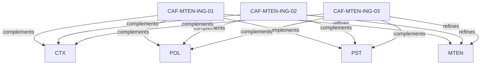

# Pattern graph: MTEN:ING (v1)

Source: `graphs/pattern_graph_MTEN_ING_v1.mmd`

Family: **MTEN** (subfamily: **ING**).
Edges to outside families are collapsed to family nodes.

## Links

- [CAF-MTEN-ING-01](../../architecture_library/patterns/caf_v1/definitions_v1/CAF-MTEN-ING-01.yaml) — Domain / Subdomain-Based Routing
- [CAF-MTEN-ING-02](../../architecture_library/patterns/caf_v1/definitions_v1/CAF-MTEN-ING-02.yaml) — Token-Embedded Tenant Claims
- [CAF-MTEN-ING-03](../../architecture_library/patterns/caf_v1/definitions_v1/CAF-MTEN-ING-03.yaml) — Explicit Tenant Selection with Session Binding
