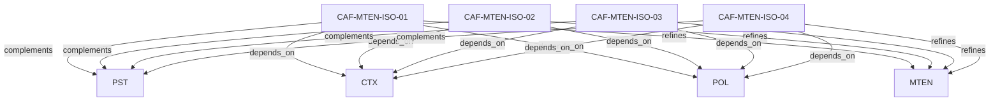

# Pattern graph: MTEN:ISO (v1)

Source: `graphs/pattern_graph_MTEN_ISO_v1.mmd`

Family: **MTEN** (subfamily: **ISO**).
Edges to outside families are collapsed to family nodes.

## Links

- [CAF-MTEN-ISO-01](../../architecture_library/patterns/caf_v1/definitions_v1/CAF-MTEN-ISO-01.yaml) — Pooled Everything (Logical Isolation Baseline)
- [CAF-MTEN-ISO-02](../../architecture_library/patterns/caf_v1/definitions_v1/CAF-MTEN-ISO-02.yaml) — Pooled Compute + Partitioned Data (Bridge Isolation)
- [CAF-MTEN-ISO-03](../../architecture_library/patterns/caf_v1/definitions_v1/CAF-MTEN-ISO-03.yaml) — Silo Tenants (Dedicated Infrastructure)
- [CAF-MTEN-ISO-04](../../architecture_library/patterns/caf_v1/definitions_v1/CAF-MTEN-ISO-04.yaml) — Hybrid Isolation (Selective and Tiered)
