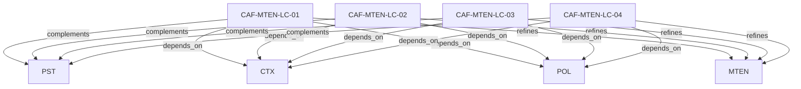

# Pattern graph: MTEN:LC (v1)

Source: `graphs/pattern_graph_MTEN_LC_v1.mmd`

Family: **MTEN** (subfamily: **LC**).
Edges to outside families are collapsed to family nodes.

## Links

- [CAF-MTEN-LC-01](../../architecture_library/patterns/caf_v1/definitions_v1/CAF-MTEN-LC-01.yaml) — Tenant Provisioning Patterns
- [CAF-MTEN-LC-02](../../architecture_library/patterns/caf_v1/definitions_v1/CAF-MTEN-LC-02.yaml) — Tenant Migration and Rebalancing
- [CAF-MTEN-LC-03](../../architecture_library/patterns/caf_v1/definitions_v1/CAF-MTEN-LC-03.yaml) — Suspension and Quarantine Patterns
- [CAF-MTEN-LC-04](../../architecture_library/patterns/caf_v1/definitions_v1/CAF-MTEN-LC-04.yaml) — Tenant Deletion and Retention
