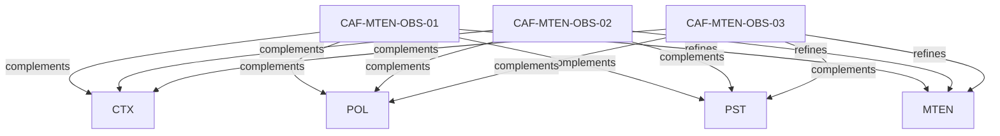

# Pattern graph: MTEN:OBS (v1)

Source: `graphs/pattern_graph_MTEN_OBS_v1.mmd`

Family: **MTEN** (subfamily: **OBS**).
Edges to outside families are collapsed to family nodes.

## Links

- [CAF-MTEN-OBS-01](../../architecture_library/patterns/caf_v1/definitions_v1/CAF-MTEN-OBS-01.yaml) — Observability as an Enforcement Primitive
- [CAF-MTEN-OBS-02](../../architecture_library/patterns/caf_v1/definitions_v1/CAF-MTEN-OBS-02.yaml) — Tenant-Scoped Telemetry (Normative)
- [CAF-MTEN-OBS-03](../../architecture_library/patterns/caf_v1/definitions_v1/CAF-MTEN-OBS-03.yaml) — Observability Across Execution Boundaries
