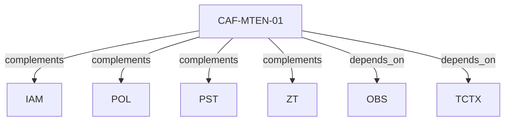

# Pattern graph: MTEN:ROOT (v1)

Source: `graphs/pattern_graph_MTEN_ROOT_v1.mmd`

Family: **MTEN** (subfamily: **ROOT**).
Edges to outside families are collapsed to family nodes.

## Links

- [CAF-MTEN-01](../../architecture_library/patterns/caf_v1/definitions_v1/CAF-MTEN-01.yaml) — Multi-Tenancy as First-Class Architectural Concern
