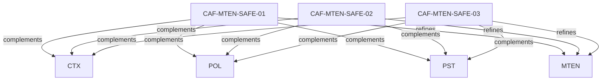

# Pattern graph: MTEN:SAFE (v1)

Source: `graphs/pattern_graph_MTEN_SAFE_v1.mmd`

Family: **MTEN** (subfamily: **SAFE**).
Edges to outside families are collapsed to family nodes.

## Links

- [CAF-MTEN-SAFE-01](../../architecture_library/patterns/caf_v1/definitions_v1/CAF-MTEN-SAFE-01.yaml) — Safety Gates as Runtime Control Points
- [CAF-MTEN-SAFE-02](../../architecture_library/patterns/caf_v1/definitions_v1/CAF-MTEN-SAFE-02.yaml) — AI-Specific Safety and Observability Patterns
- [CAF-MTEN-SAFE-03](../../architecture_library/patterns/caf_v1/definitions_v1/CAF-MTEN-SAFE-03.yaml) — Blast Radius Detection and Containment
