# Pattern graph: MTEN:VALU (v1)

Source: `graphs/pattern_graph_MTEN_VALU_v1.mmd`

Family: **MTEN** (subfamily: **VALU**).
Edges to outside families are collapsed to family nodes.

```mermaid
%% Auto-generated by tools/caf-meta/build_pattern_docs_v1.mjs
graph TD
  P_CAF_MTEN_VALU_01["CAF-MTEN-VALU-01"]
  P_CAF_MTEN_VALU_02["CAF-MTEN-VALU-02"]
  P_CAF_MTEN_VALU_03["CAF-MTEN-VALU-03"]
  P_CAF_MTEN_VALU_04["CAF-MTEN-VALU-04"]
  P_CAF_MTEN_VALU_05["CAF-MTEN-VALU-05"]
  P_CAF_MTEN_VALU_06["CAF-MTEN-VALU-06"]
  P_CAF_MTEN_VALU_07["CAF-MTEN-VALU-07"]
  P_CAF_MTEN_VALU_08["CAF-MTEN-VALU-08"]
  P_CAF_MTEN_VALU_09["CAF-MTEN-VALU-09"]
  P_CAF_MTEN_VALU_10["CAF-MTEN-VALU-10"]
  F_CTX["CTX"]
  F_MTEN["MTEN"]
  F_POL["POL"]
  F_PST["PST"]
  P_CAF_MTEN_VALU_01 -->|complements| F_PST
  P_CAF_MTEN_VALU_01 -->|depends_on| F_CTX
  P_CAF_MTEN_VALU_01 -->|depends_on| F_POL
  P_CAF_MTEN_VALU_01 -->|refines| F_MTEN
  P_CAF_MTEN_VALU_02 -->|complements| F_PST
  P_CAF_MTEN_VALU_02 -->|depends_on| F_CTX
  P_CAF_MTEN_VALU_02 -->|depends_on| F_POL
  P_CAF_MTEN_VALU_02 -->|refines| F_MTEN
  P_CAF_MTEN_VALU_03 -->|complements| F_PST
  P_CAF_MTEN_VALU_03 -->|depends_on| F_CTX
  P_CAF_MTEN_VALU_03 -->|depends_on| F_POL
  P_CAF_MTEN_VALU_03 -->|refines| F_MTEN
  P_CAF_MTEN_VALU_04 -->|complements| F_PST
  P_CAF_MTEN_VALU_04 -->|depends_on| F_CTX
  P_CAF_MTEN_VALU_04 -->|depends_on| F_POL
  P_CAF_MTEN_VALU_04 -->|refines| F_MTEN
  P_CAF_MTEN_VALU_05 -->|complements| F_PST
  P_CAF_MTEN_VALU_05 -->|depends_on| F_CTX
  P_CAF_MTEN_VALU_05 -->|depends_on| F_POL
  P_CAF_MTEN_VALU_05 -->|refines| F_MTEN
  P_CAF_MTEN_VALU_06 -->|complements| F_PST
  P_CAF_MTEN_VALU_06 -->|depends_on| F_CTX
  P_CAF_MTEN_VALU_06 -->|depends_on| F_POL
  P_CAF_MTEN_VALU_06 -->|refines| F_MTEN
  P_CAF_MTEN_VALU_07 -->|complements| F_PST
  P_CAF_MTEN_VALU_07 -->|depends_on| F_CTX
  P_CAF_MTEN_VALU_07 -->|depends_on| F_POL
  P_CAF_MTEN_VALU_07 -->|refines| F_MTEN
  P_CAF_MTEN_VALU_08 -->|complements| F_PST
  P_CAF_MTEN_VALU_08 -->|depends_on| F_CTX
  P_CAF_MTEN_VALU_08 -->|depends_on| F_POL
  P_CAF_MTEN_VALU_08 -->|refines| F_MTEN
  P_CAF_MTEN_VALU_09 -->|complements| F_PST
  P_CAF_MTEN_VALU_09 -->|depends_on| F_CTX
  P_CAF_MTEN_VALU_09 -->|depends_on| F_POL
  P_CAF_MTEN_VALU_09 -->|refines| F_MTEN
  P_CAF_MTEN_VALU_10 -->|complements| F_PST
  P_CAF_MTEN_VALU_10 -->|depends_on| F_CTX
  P_CAF_MTEN_VALU_10 -->|depends_on| F_POL
  P_CAF_MTEN_VALU_10 -->|refines| F_MTEN
```

## Links

- [CAF-MTEN-VALU-01](../../architecture_library/patterns/caf_v1/definitions_v1/CAF-MTEN-VALU-01.yaml) — Global Tenancy Invariants
- [CAF-MTEN-VALU-02](../../architecture_library/patterns/caf_v1/definitions_v1/CAF-MTEN-VALU-02.yaml) — Routing & Tenant Context Validation
- [CAF-MTEN-VALU-03](../../architecture_library/patterns/caf_v1/definitions_v1/CAF-MTEN-VALU-03.yaml) — Identity & Access Validation
- [CAF-MTEN-VALU-04](../../architecture_library/patterns/caf_v1/definitions_v1/CAF-MTEN-VALU-04.yaml) — Lifecycle Validation
- [CAF-MTEN-VALU-05](../../architecture_library/patterns/caf_v1/definitions_v1/CAF-MTEN-VALU-05.yaml) — Isolation Validation
- [CAF-MTEN-VALU-06](../../architecture_library/patterns/caf_v1/definitions_v1/CAF-MTEN-VALU-06.yaml) — Cost & Usage Enforcement Validation
- [CAF-MTEN-VALU-07](../../architecture_library/patterns/caf_v1/definitions_v1/CAF-MTEN-VALU-07.yaml) — Observability, Audit & Safety Validation
- [CAF-MTEN-VALU-08](../../architecture_library/patterns/caf_v1/definitions_v1/CAF-MTEN-VALU-08.yaml) — Agent-Specific Validation
- [CAF-MTEN-VALU-09](../../architecture_library/patterns/caf_v1/definitions_v1/CAF-MTEN-VALU-09.yaml) — Enterprise & Compliance Mode Validation
- [CAF-MTEN-VALU-10](../../architecture_library/patterns/caf_v1/definitions_v1/CAF-MTEN-VALU-10.yaml) — Anti-Pattern Detection Checklist
