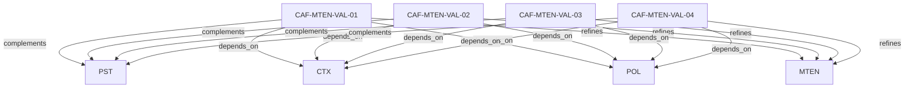

# Pattern graph: MTEN:VAL (v1)

Source: `graphs/pattern_graph_MTEN_VAL_v1.mmd`

Family: **MTEN** (subfamily: **VAL**).
Edges to outside families are collapsed to family nodes.

## Links

- [CAF-MTEN-VAL-01](../../architecture_library/patterns/caf_v1/definitions_v1/CAF-MTEN-VAL-01.yaml) — 1. Global Tenancy Invariants
- [CAF-MTEN-VAL-02](../../architecture_library/patterns/caf_v1/definitions_v1/CAF-MTEN-VAL-02.yaml) — 2. Routing & Tenant Context Validation
- [CAF-MTEN-VAL-03](../../architecture_library/patterns/caf_v1/definitions_v1/CAF-MTEN-VAL-03.yaml) — 3. Identity & Access Validation
- [CAF-MTEN-VAL-04](../../architecture_library/patterns/caf_v1/definitions_v1/CAF-MTEN-VAL-04.yaml) — 10. Anti-Pattern Detection Checklist
